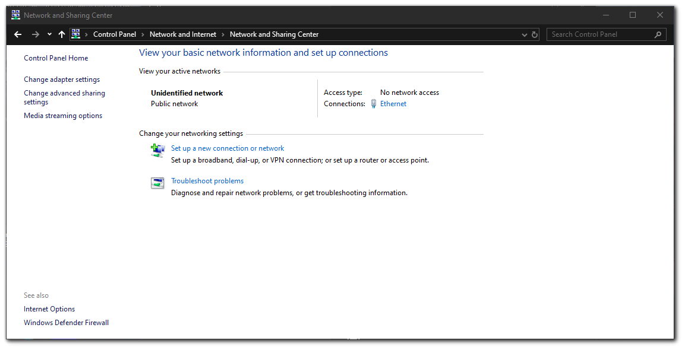
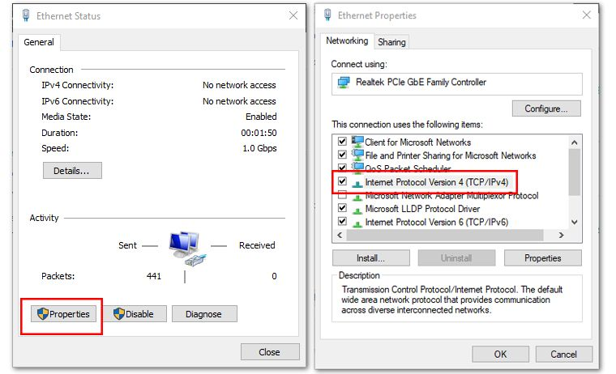
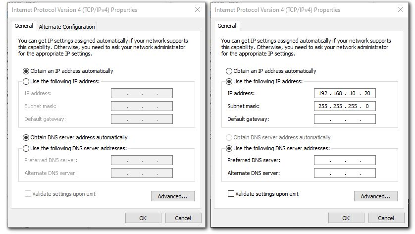
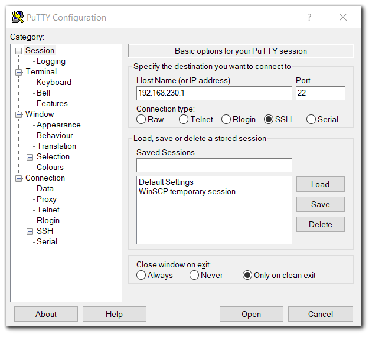
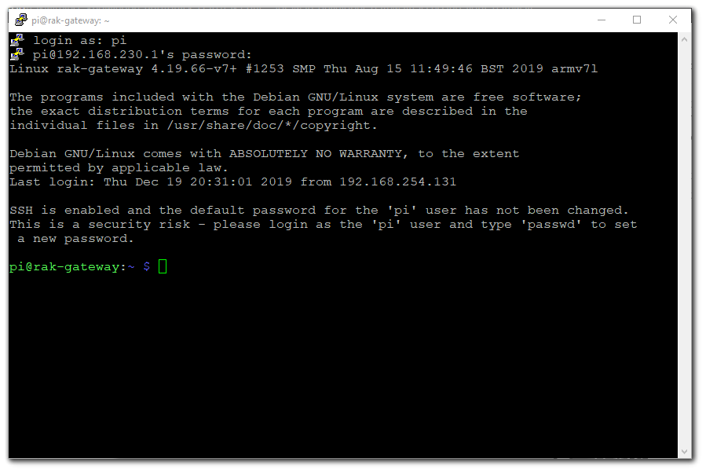
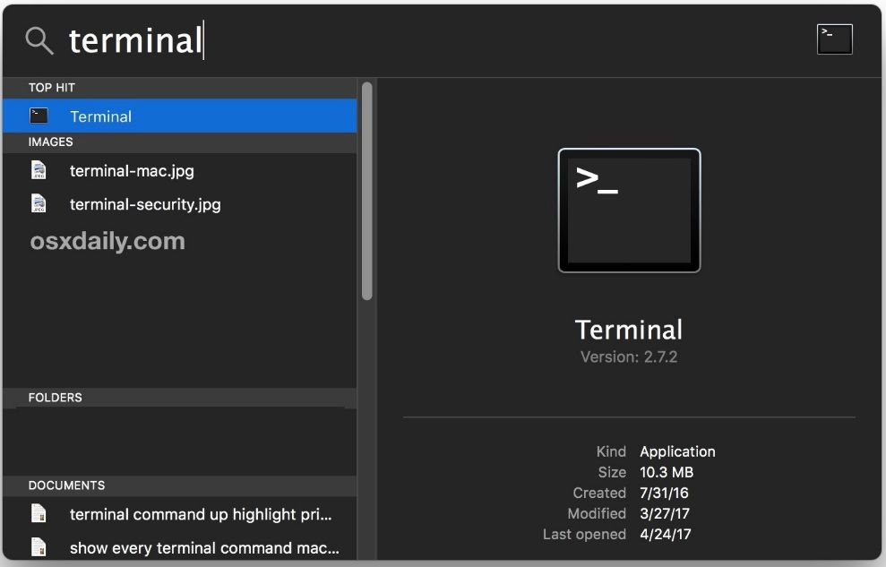
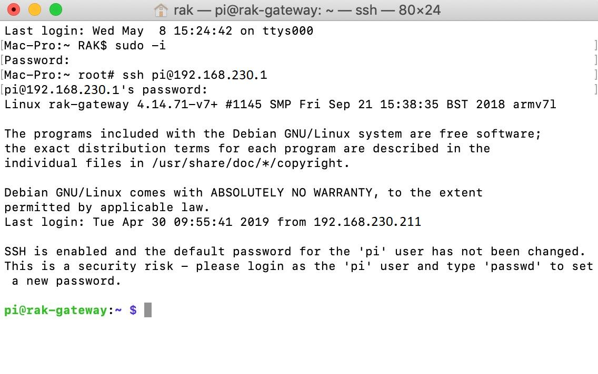

## Accessing Your Gateway

After burning the image into the SD Card, make sure you have inserted the SD Card with the Latest Firmware installed to the Raspberry Pi 3B+ / 4 with the RAK2245 Pi Hat LoRaWAN® Concentrator Module and the LoRa® and GPS Antenna attached to it. After which, you can now safely power on the gateway. In this document, several ways in accessing the gateway are provided to have different alternatives for you to choose depending on the availability of the requirements needed.

>**Warning**: Before Powering the Raspberry Pi, you should install the LoRa® and GPS Antennas. Not doing so might damage the boards.

### 1. Wi-Fi AP Mode

By default, the LoRaWAN® Gateway will work in Wi-Fi AP Mode which means that you can find an SSID named like "Rakwireless_XXXX" on your PC Wi-Fi Network List.

>**Note:** Connect to this Wi-Fi SSID by using "rakwireless" as the default password. The default IP address of the LoRaWAN® Gateway's Wi-Fi is `192.168.230.1` . Take note of this IP address as this will be needed in connecting via SSH.

### 2. Via the Ethernet Port on the Raspberry Pi 
You can also connect your PC with the LoRaWAN® Gateway through an Ethernet cable. By default, the IP address of the LoRaWAN® Gateway’s Ethernet interface is `192.168.10.10`, so you need to set the IP address of your PC’s Ethernet to the same network segment, for example, `192.168.10.20`.

* To do this in Windows, go to Control Panel -> Network and Internet -> Network and Sharing Center and Click Ethernet

* Click Properties then Choose Internet Protocol Version 4 (TCP/IPv4).

* By default, it will obtain an IP Address automatically. Click the Option "Use the following IP Address" and enter the IP Address: `192.168.10.20` and press OK.

Now , you should be able to access your LoRaWAN® Gateway from your PC successfully using the IP Address `192.168.10.10` through SSH.

## Log into the LoRa Gateway via SSH

### 1. Windows OS
SSH (Secure Shell) is typically used to log in to a remote machine and execute commands. There are a lot of free and good SSH Clients out there namely [Putty](https://www.chiark.greenend.org.uk/~sgtatham/putty/latest.html), [BitVise SSH Client](https://www.bitvise.com/ssh-client-download), [MobaXterm](https://mobaxterm.mobatek.net/) and many more. Feel free to choose one that fits your needs, you will be using Putty for this guide.

* If you have connected to the LoRaWAN® Gateway through Wi-Fi AP Mode, the IP Address is `192.168.230.1`
* If you have connected to the LoRaWAN® Gateway through Ethernet, the IP Address is `192.168.10.10`
* It will then prompt you to enter the username and password. The default username is "**pi**" and the default password is "**raspberry**"

### 2. Mac OS
Open the Terminal of Mac OS. Launch the Terminal application, which is found in "/Applications/Utilities/" directory but you can also launch it from Spotlight by hitting Command + Spacebar and typing “Terminal” and then return:

* Open the terminal of Mac OS. Enter root mode by typing the following command: `sudo -i`

* If you are not in root mode, enter `ssh pi@192.168.230.1` in the terminal to login to your LoRaWAN® Gateway, the default username is "**pi**" and the default password is "**raspberry**".
* If you connect your PC with the LoRaWAN® Gateway through Ethernet Cable, you should enter `ssh pi@192.168.10.10`, the default username is "**pi**" and the default password is "**raspberry**".

### 3. Linux OS

If the OS of your PC is Linux, you should do the same as the Mac OS, except the root mode.