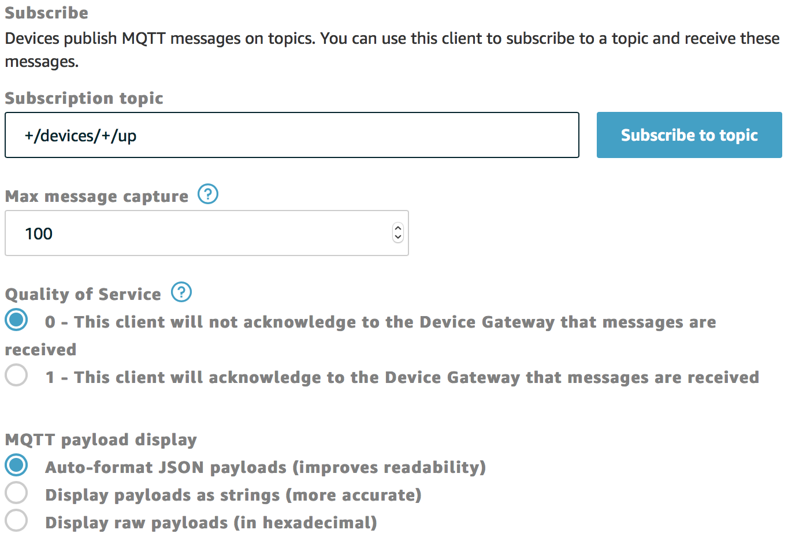
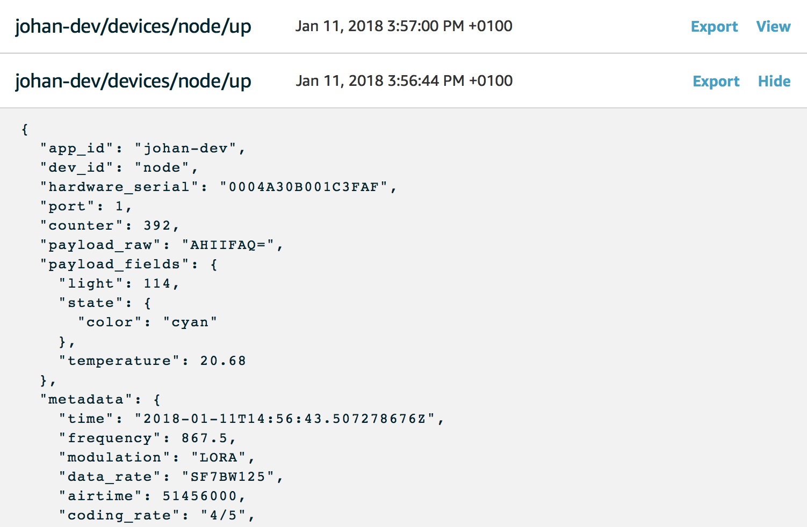
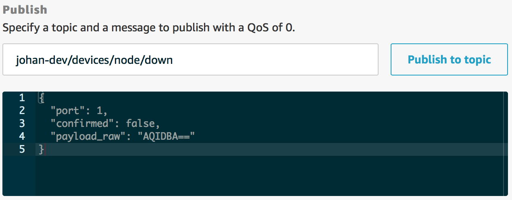

The integration publishes uplink messages to AWS IoT MQTT and subscribes to downlink messages. The integration uses the same [MQTT topic and payload format](..mqtt/api.html#uplink-messages) as The Things Network MQTT.

This guide walks you through subscribing and storing uplink messages and publishing a downlink message.

> AWS IoT supports MQTT, HTTP and WebSockets to work with data programmatically. See [Protocols](https://docs.aws.amazon.com/iot/latest/developerguide/protocols.html) for more information.

## Uplink Messages

When developing LoRaWAN applications in AWS IoT, you often want to view data as it arrives for testing if everything works. AWS IoT features a Test view to subscribe to an MQTT topic and show live data.

1. Log in to the [AWS Management Console](http://console.aws.amazon.com)
2. In **Services** under **Internet Of Things**, go to **AWS IoT**
3. In the menu on the left, go to **Test**
4. Enter in **Subscription topic** the uplink topic `+/devices/+/up` (or `<AppID>/devices/+/up` for a specific application). [Read more about uplink topics](https://www.thethingsnetwork.org/docs/applications/mqtt/api.html#uplink-messages)

   

5. Click **Subscribe to topic**
6. Uplink messages are shown as they arrive

   

## Downlink Messages

When developing LoRaWAN applications in AWS IoT, you often want to send downlink messages to test the behavior of your device. The AWS IoT Test view can also be used to publish downlink messages.

1. Log in to the [AWS Management Console](http://console.aws.amazon.com)
2. In **Services** under **Internet Of Things**, go to **AWS IoT**
3. In the menu on the left, go to **Test**
4. Under **Publish**, enter a downlink topic to publish to: `<AppID>/devices/<DevID>/down`
5. Enter the downlink message according to the downlink message format (see [MQTT topic and payload format](https://www.thethingsnetwork.org/docs/applications/mqtt/api.html#downlink-messages)):

   For example, sending raw payload:

   ```js
   {
     // LoRaWAN FPort
     "port": 1,
     // Unconfirmed downlink
     "confirmed": false,
     // Base64 encoded payload
     "payload_raw": "AQIDBA=="
   }
   ```

   

6. Click **Publish to topic**
7. See the downlink message scheduled in The Things Network Console:

   

> See [Protocols](https://docs.aws.amazon.com/iot/latest/developerguide/protocols.html) to learn how to interact with the AWS IoT message broker programmatically.
