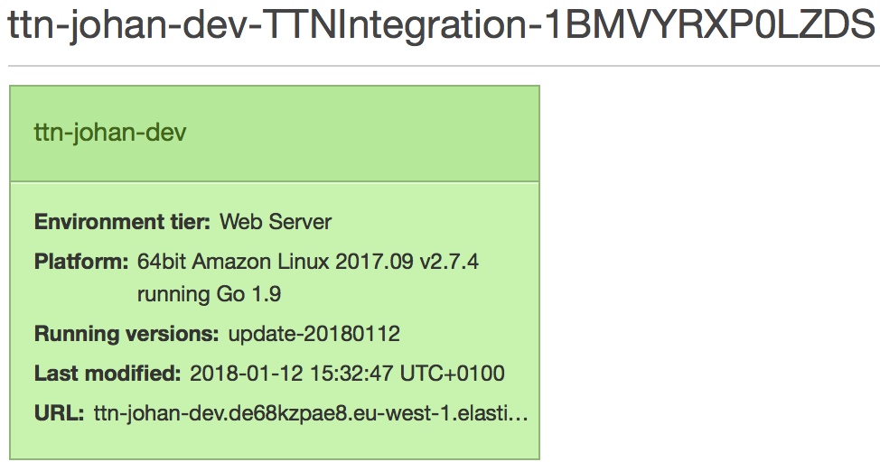

Are you encountering issues with the AWS IoT integration? This guide walks you through viewing health and getting log files of the integration that may help resolving issues.

## Check Health

1. [Update the integration](./update.md) to the latest version
2. Log in to the [AWS Management Console](http://console.aws.amazon.com)
3. In **Services** under **Compute**, go to **Elastic Beanstalk**
4. Find your application

   

5. Click the tile of your environment
6. You may see degraded health here. Click the **Causes** button for diagnosis

## Get Log Files

1. Go to the Elastic Beanstalk environment of your application (see [above](#check-health))
2. Click **Logs** in the menu on the left
3. Click **Request Logs** and click **Last 100 Lines**

   

4. Click the **Download** link of last 100 lines requested
5. The logs of the integration process can be found under:

   * `/var/log/app-1.error.log`
   * `/var/log/app-1.log`

   Healthy logs look as follows:

   ```
   -------------------------------------
   /var/log/app-1.error.log
   -------------------------------------
   (empty)
   ```

   ```
   -------------------------------------
   /var/log/app-1.log
   -------------------------------------
     INFO Published uplink                         DevID=node
     INFO Updated shadow reported state            DevID=node
     INFO Published uplink                         DevID=node
     INFO Updated shadow reported state            DevID=node
     ...
   ```

   Any `WARN`, `ERROR` or `FATAL` should provide enough context to resolve the issue, e.g. wrong authentication parameters (app ID or access key), wrong thing attributes, etc.
