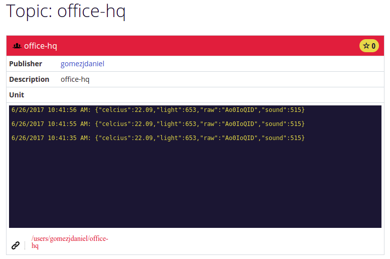

The OpenSensors integration allows you to publish uplink data to the OpenSensors broker.

OpenSensors is a real time data exchange for the internet of things, called ‘Twitter for Sensors’ by wired.com. Their mission is to make data generated from IoT useful and accessible.

Go to [www.opensensors.io](https://www.opensensors.io) for more information.



## How to Setup OpenSensors

1. Find your [API key](https://opensensorsio.helpscoutdocs.com/article/42-where-is-my-api-key)
2. Create a new [device](https://opensensorsio.helpscoutdocs.com/article/36-how-do-i-create-a-new-device) and get the device's **Client ID** and **password**. This will serve as a proxy for all devices in your The Things Network application. The **Client ID** is a numeric value. Note that the password will be shown only once, although you can easily reset it by clicking **Reset password**.

## Create the Integration

In the The Things Network Console you will be asked to enter the four following settings:

1. Your OpenSensors.io username
2. The API Key from your profile
3. The Client ID of the proxy device
4. The device password of the proxy device

## Uplink

Device uplinks will be published to topics in the form `users/<opensensors-username>/<ttn-device-id>`. The topics will be created automatically. The payload contains the decoded payload and the `raw` field with the base64 encoded raw payload. Note that this may overwrite an existing `raw` field that is output of your decoder or converter payload function.

Example published payload:

```
{
  "celcius": 25.19,
  "light": 759,
  "raw": "MDJGODAyMDcwMThB",
  "sound": 473
}
```
