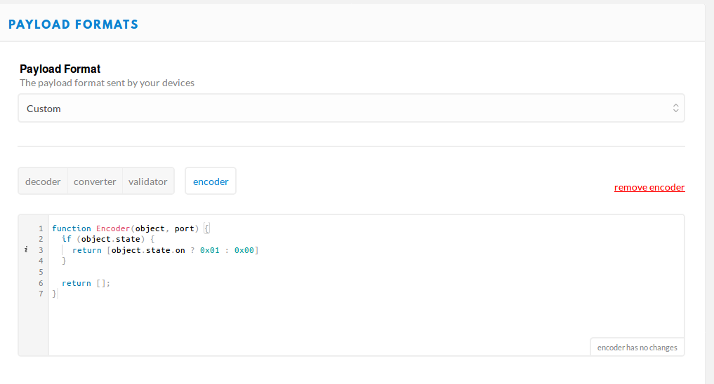
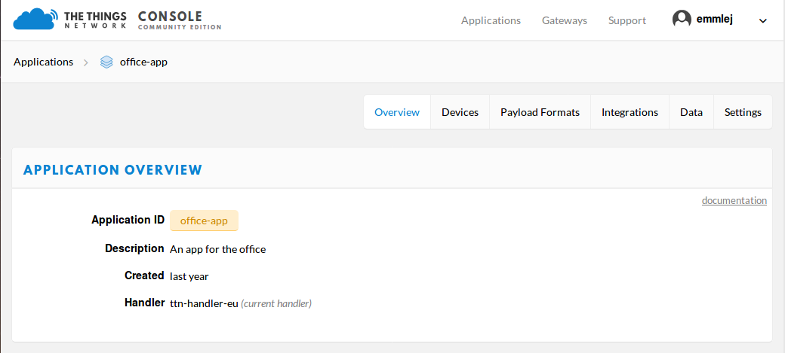

This package provides you an easy way to exchange traffic with The Things Network via MQTT and manage your applications.

## MQTTClient

The class constructor can be called following this scheme:

```python
MQTTClient(app_id, access_key, mqtt_address="", discovery_address="discovery.thethings.network:1900")
```

* `app_id`: **string** this the name given to the application when it was created.
  
  
* `access_key`: **string** this can be found at the bottom of the application page under **ACCESS KEYS**.
  

* `mqtt_address`: **string** this is the address of the handler to which the application was registered, in the `{hostname}:{port}` format.

* `discovery_address`: **string** this is the address of the discovery server to use in order to find back the address of the MQTT handler, in the `{hostname}:{port}` format.

    If the `mqtt_address` is set, the `discovery_address` doesn't need to be set as it is only used to retrieve the `mqtt_address` from the discovery server.
    The constructor returns an **MQTTClient object** set up with the application informations, ready to be connected to The Things Network.

### connect

Connects and starts the client in the background. This function also re-establishes the client's connection in case it was closed.

```python
client.connect()
```

### close

Disconnects and stops the client from which the method is called.

```python
client.close()
```

### Using Callbacks

The callback functions are functions which are executed when a trigger event happens.

#### set_uplink_callback

Add a callback function, to be called when an uplink message is received.

```python
client.set_uplink_callback(uplink_callback)
```

##### uplink_callback

The callback function must be declared in the script following this structure:

* `uplink_callback(msg, client)`
    * `msg`: **UplinkMessage object** the message received by the client.
    * `client`: **MQTTClient object** the client from which the callback is executed.

#### set_connect_callback

Add a connection callback function to be executed when the client connects to the broker.

```python
client.set_connect_callback(connect_callback)
```

##### connect_callback

* `connect_callback(res, client)`: the function which will be executed on connection to the broker.
    * `res`: **boolean** the result of the connection. If it's true, the connection succeeded. If not, it means the connection failed.
    * `client`: **MQTTClient object** the TTN client from which the callback is called.

#### set_downlink_callback

Add a downlink callback function, with actions to execute when a downlink message is sent.

```python
client.set_downlink_callback(downlinkCallback)
```

##### downlink_callback

* `downlink_callback(mid, client)`: the function which will be a new publish behavior for our MQTT client.
    * `mid`: **int** this is the message ID for the downlink request. It can be used to track the request.
    * `client`: **MQTTClient object** the TTN client from which the callback is called.

#### set_close_callback

Add a callback to be executed when the connection to the TTN broker is closed.

```python
client.set_close_callback(close_callback)
```

##### close_callback

* `close_callback(res, client)`: the function which will be executed when the connection is closed.
    * `res`: **boolean** the result of the disconnection. If it's true, it went all as expected. If not, it means the disconnection was unexpected.
    * `client`: **MQTTClient object** the TTN client from which we call the callback.

### send

Sends a downlink to the device.

```python
client.send(dev_id, payload, port=1, conf=False, sched="replace")
```

* `dev_id`: **string** the ID of the device which will receive the message.
* `payload`: the payload of the message to be published to the broker. It can be an hexadecimal **string**, a base64 **string** like `AQ==` (this will send the raw payload `01` to your device) or a **dictionary** of JSON nature. Here is an example of a **dictionary** argument that could be passed to the method:

```json
{ "led_state": "on", "counter": 1 }
```

In case it's a **dictionary** with fields, please make sure the **encoder** function (Payload Formats section) of the application is set to make sense of the informations transmitted in each field.


* `port`: **int** the port of the device to which the message will be sent.
* `conf`: **boolean** this boolean indicates if you wish to receive a confirmation after sending the downlink message.
* `sched`: **string** this string provides the type of schedule on which the message should be sent. It can take the following values: `first`, `last`, `replace`.

### UplinkMessage

This type of object is constructed dynamically from the message received by the client, so this means some attributes can change from one message to another. Here are some constant attributes usually found in UplinkMessage objects:

* `app_id`: the application ID to which the device is registered
* `dev_id`: the ID of the device
* `port`: the port number on which the message was sent
* `payload_raw`: a buffer which contains the payload in hexadecimal
* `metadata`: this field is another object which contains all the metadata of the message. Such as: the date, the frequency, the data rate and the list of gateways.

## ApplicationClient

The class constructor can be called following this scheme:

```python
ApplicationClient(app_id, access_key, handler_address="", cert_content="", discovery_address="discovery.thethings.network:1900")
```

* `app_id`: **string** this the name given to the application when it was created.
  
* `access_key`: **string** this can be found at the bottom of the application page under **ACCESS KEYS**. You will need a key allowing you to change the settings if you wish to update your application.
* `handler_address`: **string** this is the address of the handler to which the application was registered, in the `{hostname}:{port}` format. Example: `handler.eu.thethings.network:1904`.
* `cert_content`: **string** this is the content of the certificate used to connect in a secure way to the handler. Here is a certificate example:

```
-----BEGIN CERTIFICATE-----
MIIBmjCCAUCgAwIBAgIRANKKhUVFRXhyx0gCX2h7EFwwCgYIKoZIzj0EAwIwHTEb
MBkGA1UEChMSVGhlIFRoaW5ncyBOZXR3b3JrMB4XDTE3MDgwMTA4MzQxMloXDTE4
MDgwMTA4MzQxMlowHTEbMBkGA1UEChMSVGhlIFRoaW5ncyBOZXR3b3JrMFkwEwYH
KoZIzj0CAQYIKoZIzj0DAQcDQgAEiXbWvyYjOMP4ebTYtVvdIsBwS+U3laWltR7V
ox4+kQWcGLLEg+suI9SRZyKK+frhw9JPKbVNIgEv/S50YKfMEaNhMF8wDgYDVR0P
AQH/BAQDAgKkMB0GA1UdJQQWMBQGCCsGAQUFBwMBBggrBgEFBQcDAjAPBgNVHRMB
Af8EBTADAQH/MB0GA1UdEQQWMBSCB2hhbmRsZXKCCWxvY2FsaG9zdDAKBggqhkjO
PQQDAgNIADBFAiEA+vajlz7HDZ7x6KKi/uMlrwCePEcchZRYJPc/6kPyYogCIFSy
etQ54MyIOWtwYlxG+blnxT4PWCgas5rPiaK6VP/Z
-----END CERTIFICATE-----
```

* `discovery_address`: **string** this is the address of the discovery server to use in order to find back the address of the handler to which the application in registered, in the `{hostname}:{port}` format. Example: `discovery.thethings.network:1900`.

    The constructor returns an **ApplicationClient** object set up with the application informations, ready to get the application registered on The Things Network.

### get

Gives back the [**Application**]().

```python
client.get()
```

### set_payload_format

Sets the payload format of the application.

```python
client.set_payload_format(payload_format)
```

* payload_format: **string** the new payload format.
  Example: `custom`

### set_custom_payload_functions

Sets the payload functions of the application.

```python
client.set_custom_payload_functions(encoder="", decoder="", validator="", converter="")
```

* `decoder`: **string** Javascript decoder function.
* `encoder`: **string** Javascript encoder function.
* `validator`: **string** Javascript validator function.
* `converter`: **string** Javascript converter function.

    Arguments left empty are ignored and won't be updated.
    Example:

```python
decoder_fn = """function Decoder(payload) {
  return { led: 1 };
}"""
client.set_custom_payload_functions(decoder=decoder_fn)
```

### unregister

Unregisters the application.

```python
client.unregister()
```

### register_device

Registers a new device to the application.

```python
client.register_device(dev_id, device)
```

* `dev_id`: **string** the id of the device to be registered.
* `device`: 
```python
devicetest = {
    "description": "Description",
    "appEui": "0011223344556677",
    "devEui": "9988776655443322",
    "devAddr": "11223344", # remove for OTAA
    "nwkSKey": binascii.b2a_hex(os.urandom(16)).upper(), # remove for OTAA
    "appSKey": binascii.b2a_hex(os.urandom(16)).upper(), # remove for OTAA
    "appKey": binascii.b2a_hex(os.urandom(16)).upper(), # remove for ABP
    "fCntUp": 10,
    "fCntDown": 11,
    "latitude": 100,
    "longitude": 200,
    "altitude": 300,
    "attributes": {
        "foo": "bar",
    },
    "disableFCntCheck": True,
    "uses32BitFCnt": True,
}
```

### device

Gives back the [**Device**]() object of the given id.

```python
client.device(dev_id)
```

* `dev_id`: **string** the id of the device.

### devices

Gives back the list of all the devices registered to the application.

```python
client.devices()
```

### update_device

Updates an already existing device of the application.

```python
client.update_device(dev_id, updates)
```

* `dev_id`: **string** the id of the device to be updated.
* `updates`: **dictionary** a dictionary with the fields to be updated in the device.

### delete_device

Deletes the device with the given id.

```python
client.delete_device(dev_id)
```

* `dev_id`: **string** the id of the device to be deleted.

### <a name="deviceobject"></a>Device

This objet is returned by the method `device()` of the ApplicationClient class. Here are its attributes:

* `app_id`: **string**
* `dev_id`: **string**
* `latitude`: **float**
* `longitude`: **float**
* `altitude`: **float**
* `description`: **string**
* `attributes`: **dictionary**
* `lorawan_device`: **dictionary**
    * `app_eui`: **string** 8 bytes in hexadecimal
    * `dev_eui`: **string** 8 bytes in hexadecimal
    * `dev_addr`: **string** 4 bytes in hexadecimal
    * `nwk_s_key`: **string** 16 bytes in hexadecimal
    * `app_s_key`: **string** 16 bytes in hexadecimal
    * `app_key`: **string** 16 bytes in hexadecimal
    * `f_cnt_up`: **int**
    * `f_cnt_down`: **int**
    * `disable_f_cnt_check`: **boolean**
    * `uses32_bit_f_cnt`: **boolean**

### Application

This object is returned by the method `get()` of the ApplicationClient class. Here are its attributes:

* `app_id`: **string**
* `payload_format`: **string**
* `decoder`: **string**
* `encoder`: **string**
* `converter`: **string**
* `validator`: **string**
* `register_on_join_access_key`: **string**

## HandlerClient

The class constructor can be called following this scheme:

```python
HandlerClient(app_id, access_key, discovery_address="discovery.thethings.network:1900", cert_path="")
```

* `app_id`: **string** this the name given to the application when it was created.
  
* `access_key`: **string** this can be found at the bottom of the application page under **ACCESS KEYS**. The key needs the `settings` authorization.
* `discovery_address`: **string** this is the address of the discovery server to use in order to find back the address of the handler to which the application in registered, in the `{hostname}:{port}` format.
* `cert_path`: **string** this is the path to the certificate used to connect in a secure way to the discovery server.

### data

Creates an [**MQTTClient**]() object.

```python
handler.data()
```

Returns an [**MQTTClient**]() object.

### application

Creates an [**ApplicationClient**]() object

```python
handler.application()
```

Returns an [**ApplicationClient**]() object.

## Troubleshooting

Errors can happen on connection or on some ApplicationClient's methods call, for different reasons:

* Wrong `app_id`, `access_key` or `mqtt_address` were provided to the constructor.
* The machine may not have access to the network/The MQTT server could be down/Firewall restrictions could prevent connection.
* The client process doesn't have system capabilities to open a socket
* The MQTT server uses MQTTS, but the client won't accept the TLS certificate.
* The Application client is not able to get the application or a device.
  Errors could also happen when closing connection, in case the disconnection is unexpected. This errors are the most common ones, there are also edges cases not mentioned in this section.
