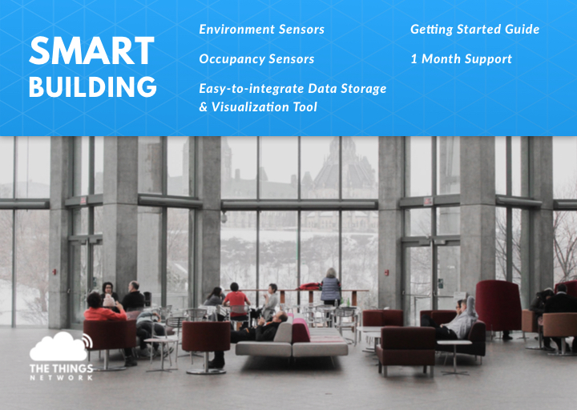

Connect your office and optimize the work performance.

The smart building package enables the transformation of any building or facility into a smart connected asset, that can be remotely managed and controlled. The sensors included in the kit provide the means of monitoring the most important indicators in a smart building solution. 

The easy-to-install package contains:
* Environment sensors
* Occupancy sensors
* Easy to integrate data storage and visualization tool
* Getting started guide 
* 1 month support




## Connecting Devices
* [Create an account](https://account.thethingsnetwork.org/) at The Things Network
* (If applicable) Connect your pre-configured gateway
* Install the Android app [Elsys Sensor Settings](https://play.google.com/store/apps/details?id=se.elsys.nfc.elsysnfc)
* Visit [The Things Network Console](https://console.thethingsnetwork.org/), create a new application and register all devices using the Device EUIs which you can find on the back of the sensors. The devices can be provisioned through NFC via the Elsys app. For more information you can walk through the Elsys' [Operating Manual](https://www.elsys.se/en/wp-content/uploads/sites/3/2016/09/OPERATING-MANUAL-ERS_A5_V3.pdf) or check out Elsys’ [Video tutorials](https://www.elsys.se/en/lora-videos/)

## Decode data

To make sense out of the raw payload, the data need to be decoded. Select the *Payload Formats*, make sure the *Decoder* is selected and copy-paste the Javascript code below. 

This will change the payload which might look like this: `01 00 EA 02 36 04 03 30 05 01 07 0E 32 15 43 24` to this:

```
{
  "humidity": 54,
  "light": 816,
  "motion": 1,
  "soundAvg": 36,
  "soundPeak": 67,
  "temperature": 23.4,
  "vdd": 3634
}
```

### Decoder
```
function Decoder(bytes, port) {
  if (port === 0) {
    return;
  }
  var TYPE_TEMP = 0x01; //temp 2 bytes -3276.8°C -->3276.7°C
  var TYPE_RH = 0x02; //Humidity 1 byte 0-100%
  var TYPE_ACC = 0x03; //acceleration 3 bytes X,Y,Z -128 --> 127 +/-63=1G
  var TYPE_LIGHT = 0x04; //Light 2 bytes 0-->65535 Lux
  var TYPE_MOTION = 0x05; //No of motion 1 byte 0-255
  var TYPE_CO2 = 0x06; //Co2 2 bytes 0-65535 ppm
  var TYPE_VDD = 0x07; //VDD 2byte 0-65535mV
  var TYPE_ANALOG1 = 0x08; //VDD 2byte 0-65535mV
  var TYPE_GPS = 0x09; //3bytes lat 3bytes long binary
  var TYPE_PULSE1 = 0x0A; //2bytes relative pulse count
  var TYPE_PULSE1_ABS = 0x0B; //4bytes no 0->0xFFFFFFFF
  var TYPE_EXT_TEMP1 = 0x0C; //2bytes -3276.5C-->3276.5C
  var TYPE_EXT_DIGITAL = 0x0D; //1bytes value 1 or 0
  var TYPE_EXT_DISTANCE = 0x0E; //2bytes distance in mm
  var TYPE_ACC_MOTION = 0x0F; //1byte number of vibration/motion
  var TYPE_IR_TEMP = 0x10; //2bytes internal temp 2bytes external temp -3276.5C-->3276.5C
  var TYPE_OCCUPANCY = 0x11; //1byte data
  var TYPE_WATERLEAK = 0x12; //1byte data 0-255
  var TYPE_GRIDEYE = 0x13;  //65byte temperature data 1byte ref+64byte external temp
  var TYPE_PRESSURE = 0x14; //4byte pressure data (hPa)
  var TYPE_SOUND = 0x15; //2byte sound data (peak/avg)
  var TYPE_PULSE2 = 0x16; //2bytes 0-->0xFFFF
  var TYPE_PULSE2_ABS = 0x17; //4bytes no 0->0xFFFFFFFF
  var TYPE_ANALOG2 = 0x18; //2bytes voltage in mV
  var TYPE_EXT_TEMP2 = 0x19; //2bytes -3276.5C-->3276.5C

  var bin16dec = function(bin) {
      var num=bin&0xFFFF;
      if (0x8000 & num)
          num = - (0x010000 - num);
      return num;
  }

  var bin8dec = function(bin) {
      var num=bin&0xFF;
      if (0x80 & num)
          num = - (0x0100 - num);
      return num;
  }

  var hexToBytes = function(hex) {
      for (var bytes = [], c = 0; c < hex.length; c += 2)
          bytes.push(parseInt(hex.substr(c, 2), 16));
      return bytes;
  }

  var decoded = {};
  for(i=0;i<bytes.length;i++){
        switch(bytes[i]){
            case TYPE_TEMP: //Temperature
                var temp=(bytes[i+1]<<8)|(bytes[i+2]);
                temp=bin16dec(temp);
                decoded.temperature=temp / 10;
                i+=2;
            break;
            case TYPE_RH: //Humidity
                var rh=(bytes[i+1]);
                decoded.humidity=rh;
                i+=1;
            break;
            case TYPE_ACC: //Acceleration
                decoded.x=bin8dec([i+1]);
                decoded.y=bin8dec(bytes[i+2]);
                decoded.z=bin8dec(bytes[i+3]);
                i+=3;
            break;
            case TYPE_LIGHT: //Light
                var light=(bytes[i+1]<<8)|(bytes[i+2]);
                decoded.light=light;
                i+=2;
            break;
            case TYPE_MOTION: //Motion sensor(PIR)
                var motion=(bytes[i+1]);
                decoded.motion=motion;
                i+=1;
            break;
            case TYPE_CO2: //CO2
                var co2=(bytes[i+1]<<8)|(bytes[i+2]);
                decoded.co2=co2;
                i+=2;
            break;
            case TYPE_VDD: //Battery level
                var vdd=(bytes[i+1]<<8)|(bytes[i+2]);
                decoded.vdd=vdd;
                i+=2;
            break;
            case TYPE_ANALOG1: //Analog input 1
                var analog1=(bytes[i+1]<<8)|(bytes[i+2]);
                decoded.analog1=analog1;
                i+=2;
            break;
            case TYPE_GPS: //gps
                decoded.lat=(bytes[i+1]<<16)|(bytes[i+2]<<8)|(bytes[i+3]);
                decoded.long=(bytes[i+4]<<16)|(bytes[i+5]<<8)|(bytes[i+6]);
                i+=6;
            break;
            case TYPE_PULSE1: //Pulse input 1
                var pulse1=(bytes[i+1]<<8)|(bytes[i+2]);
                decoded.pulse1=pulse1;
                i+=2;
            break;

            case TYPE_EXT_TEMP1: //External temp
            var temp=(data[i+1]<<8)|(data[i+2]);
            temp=bin16dec(temp);
            decoded.externalTemperature=temp/10;
            i+=2;
            break
            case TYPE_EXT_DIGITAL: //Digital input
            decoded.digital=(data[i+1]);
            i+=1;
            break
            case TYPE_EXT_DISTANCE: //Distance sensor input
            decoded.distance=(data[i+1]<<8)|(data[i+2]);
            i+=2;
            break
            case TYPE_ACC_MOTION: //Acc motion
            decoded.accMotion=(data[i+1]);
            i+=1;
            break
            case TYPE_IR_TEMP: //IR temperature
            var iTemp=(data[i+1]<<8)|(data[i+2]);
            iTemp=bin16dec(iTemp);
            var eTemp=(data[i+3]<<8)|(data[i+4]);
            eTemp=bin16dec(eTemp);
            decoded.irInternalTemperature=iTemp/10;
            decoded.irExternalTemperature=eTemp/10;
            i+=4;
            break
            case TYPE_OCCUPANCY: //Body occupancy
            decoded.occupancy=(data[i+1]);
            i+=1;
            break
            case TYPE_WATERLEAK: //Water leak
            decoded.waterleak=(data[i+1]);
            i+=1;
            break
            case TYPE_GRIDEYE: //Grideye data
            i+=65;
            break
            case TYPE_PRESSURE: //External Pressure
            var temp=(data[i+1]<<24)|(data[i+2]<<16)|(data[i+3]<<8)|(data[i+4]);
            decoded.pressure=temp/1000;
            i+=4;
            break
            case TYPE_SOUND: //Sound
            decoded.soundPeak=(bytes[i+1]);
            decoded.soundAvg=(bytes[i+2]);
            i+=2;
            break
            case TYPE_PULSE2: //Pulse 2
            decoded.pulse2=(data[i+1]<<8)|(data[i+2]);
            i+=2;
            break
            case TYPE_PULSE2_ABS: //Pulse input 2 absolute value
            decoded.pulseAbs2=(data[i+1]<<24)|(data[i+2]<<16)|(data[i+3]<<8)|(data[i+4]);
            i+=4;
            break
            case TYPE_ANALOG2: //Analog input 2
            decoded.analog2=(data[i+1]<<8)|(data[i+2]);
            i+=2;
            break
            case TYPE_EXT_TEMP2: //External temp 2
            var temp=(data[i+1]<<8)|(data[i+2]);
            temp=bin16dec(temp);
            decoded.externalTemperature2=temp/10;
            i+=2;
            break
            default: //somthing is wrong with data
            i=data.length;
            break;
        }
    }
  return decoded;
}
```

## Data storage & visualization using myDevices Cayenne
* Create an account on [myDevices](https://mydevices.com/)
* Add the Cayenne integration to The Things Network Console
* Register all devices on myDevices Cayenne
* Create a public dashboard with all devices combined and share the public dashboard 

> Having difficulties with creating this dashboard? Have a look at the detailed documentation on [myDevices Cayenne](https://www.thethingsnetwork.org/docs/applications/cayenne/)


