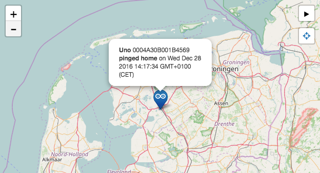
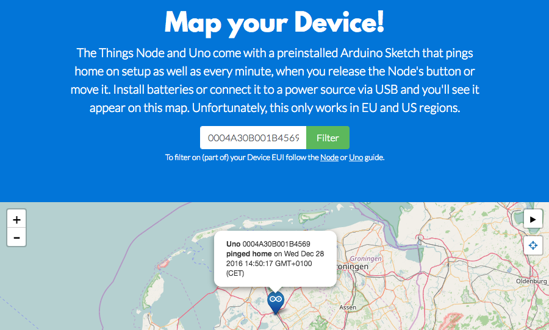

# Map your Device!
The Things Node comes with a preinstalled Arduino Sketch that pings home and sends the sensor data on setup as well as every minute, when you release its button or start moving the device.

> As soon as you upload your first sketch it will overwrite the preinstalled one!

Simply insert batteries or connect it to a power source via USB and you'll see it appear on the map at [ttn.fyi/activate](http://ttn.fyi/activate):



## Power your Device

While you keep an eye on the map at [ttn.fyi/activate](http://ttn.fyi/activate), follow these steps:

1.  Open the case using a double-slot (cross) screw drive.
2.  Either insert 3 AAA batteries or use a Micro-USB cable to connect the device to your computer or a power adapter.

    You can find the connector between the battery compartment and the top side of the case:

    

    > Some Micro-USB connectors may not fit the limited space between the batteries compartment and casing. The one we ship with the Uno should.

Soon, you should see your device appear on the map.

### How do we get your location?

The Node does not have a GPS sensor, but we do know the location of most gateways. Your device will appear in the center of all gateways that forwarded its message.

## Identify your Device

If you can't tell by the location, you will need your unique Device EUI. The preinstalled sketch prints this to USB port every time it sends data. You can read it using the Arduino IDE's Serial Monitor.

1.  Follow [Arduino / IDE Setup & Usage](../arduino/ide.md) to setup the IDE.
2.  Follow SparkFun's [Installation Instructions](https://github.com/sparkfun/Arduino_Boards#installation-instructions) to add the additional board manager and install the **SparkFun AVR Boards**.
3.  Make sure your device is connected to your computer with a Micro-USB cable.    

    > Make sure you use a cable that supports data, not just power. The one we ship with the Uno should work.

4.  In the Arduino IDE, select **Tools > Boards > SparkFun Pro Micro**.
5.  Select **Tools > Processor > ATmega32U4 (3.3V, 8Mhz)**.
6.  Select the Node's Serial Port under **Tools > Port**.

    > Unlike The Things Uno, which the Arduino IDE recognizes as *Arduino Leonardo*, it does not always recognize the Node as *SparkFun Pro Micro*. You will have to see what `/dev/*usb*` (Mac/Linux) or `COM` (Windows) option appears in the menu after connecting the Node.
    
    > Another [common issue](troubleshooting.md#serial-port-not-showing) is that on recent Macs the Node may not appear at all. We suggest to connect via an USB hub.
    
7.  Select **Tools > Serial Monitor** `Ctrl/⌘ Shift M` to open the Serial Monitor.

    Press the Node's button and it should print a list of information:

    ```
    EUI: 0004A30B001B7AD2
    Battery: 3223
    AppEUI: 70B3D57EF000001C
    DevEUI: 0004A30B001B7AD2
    Band: 868
    Data Rate: 5
    RX Delay 1: 1000
    RX Delay 2: 2000
    Total airtime: 0.00 s
    Light: 25
    Temperature: 23.16 C
    Temperature alert: No
    Moving: No
    Button pressed: No
    Color: Yellow
    USB connected: Yes
    Battery voltage: 4704 MV
    ```
    
    The first `EUI` value is what we're looking for.
    
8.  Switch back to [ttn.fyi/activate](http://ttn.fyi/activate) and scroll to the filter input.
9.  Enter the EUI and click **Filter**.

    The map will now show your device only:

    
    
🎉 Congrats! When you are done playing with the temperature, motion and button sensor, continue to the [Quick Start](quick-start.md) to learn how to upload your own sketch.
