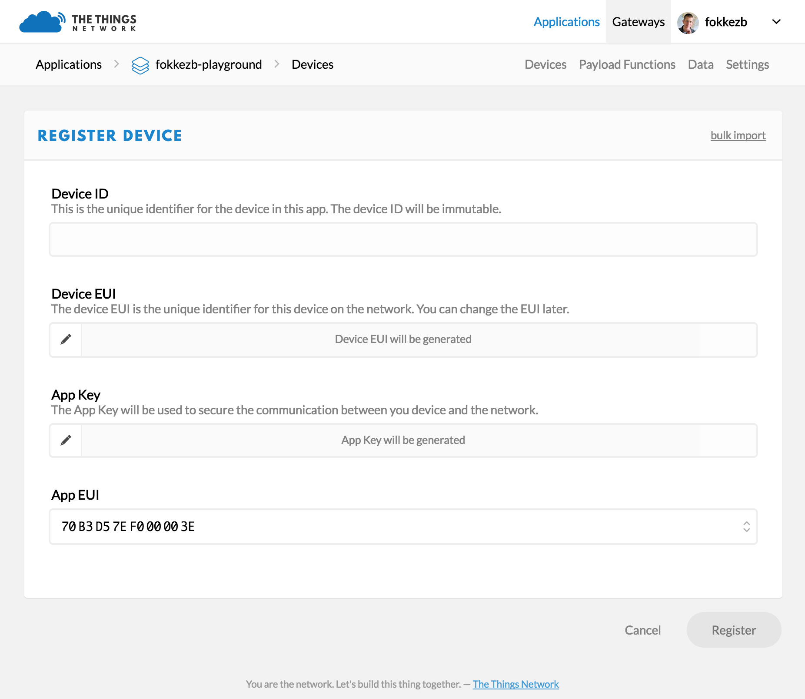
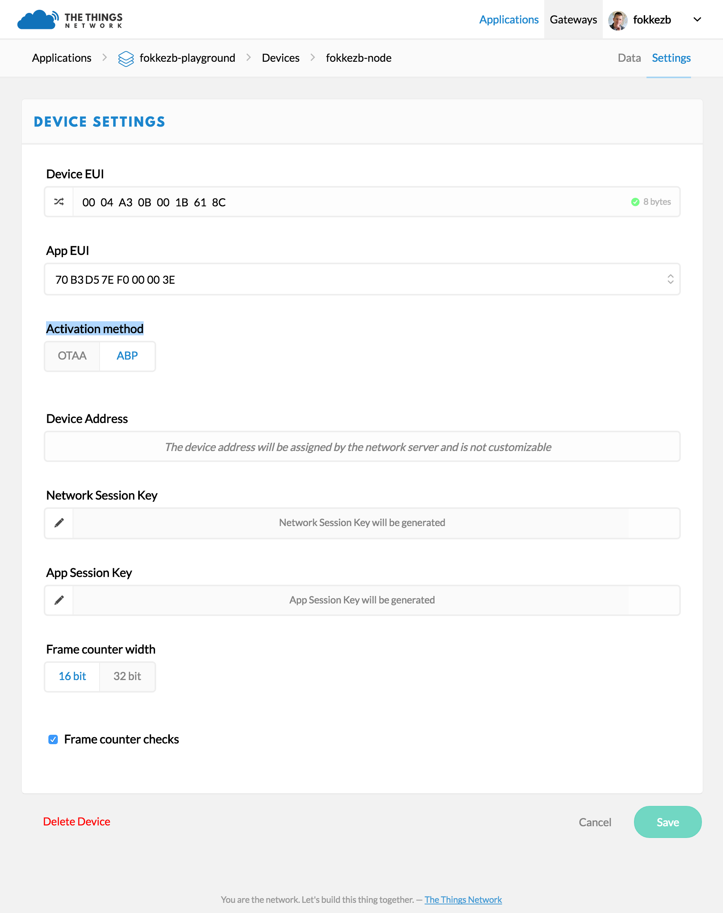

# Device Registration

Before a device can communicate via The Things Network you need to register it with an application.

To use the default **Over The Air Activation** (OTAA) you will need to register your device with its Device EUI. See the documentation of your device for instructions, as for example that of [The Things Uno](uno/quick-start.md#get-your-device-eui).

1.  Log in and open the [Console](https://console.thethingsnetwork.org/).

2.  If you don't have an application yet, you need to [create one](https://console.thethingsnetwork.org/applications/add). For more information on how to do this have a look a the [**Applications**](../applications/add.md) section.

3.  Open the application to which you wish to add a device and click **register device**.

    * For **Device ID**, choose a - for this application - unique ID of lower case, alphanumeric characters and nonconsecutive `-` and `_`.
    * For **Device EUI**, copy-paste the one you retrieved from your device.

        > If you plan to switch to [ABP](#personalize-device-for-abp) anyway, click the <i class="ion-shuffle"></i> button have one generated for you.
    
    * Leave the **App Key** to be generated.
    * For **App EUI**, select the generated EUI from the list.

    

4.  Click **Register** to finish.

    You will be redirected to the newly registered device where you can find the generated **App Key** needed to activate the device.

## Personalize device for ABP

Normally, you'd use Over The Air Activation (OTAA) to negotiate session keys for further communication. You have the option to personalize a device, which means you will generate or assign session keys manually and use hard code them on the device.

> In production, you'll want to use OTAA. This is more reliable because the activation will be confirmed and more secure because the session keys will be negotiated with every activation. ABP is useful for workshops because you don't have to wait for a downlink window to become available to confirm the activation.

1.  In the Console, go to the device you'd like to personalize.
2.  From the top right menu, select **Settings**.
3.  For **Activation method**, click **ABP**.

    * Leave the **Network Session Key** and **App Session Key** to be generated for you or click **customize it** if you'd like to set them yourself.

    
    
5.  Click **Save** to finish.

    You will be redirected back to the device, where you will find the **Device Address** and session keys needed to activate the device.
