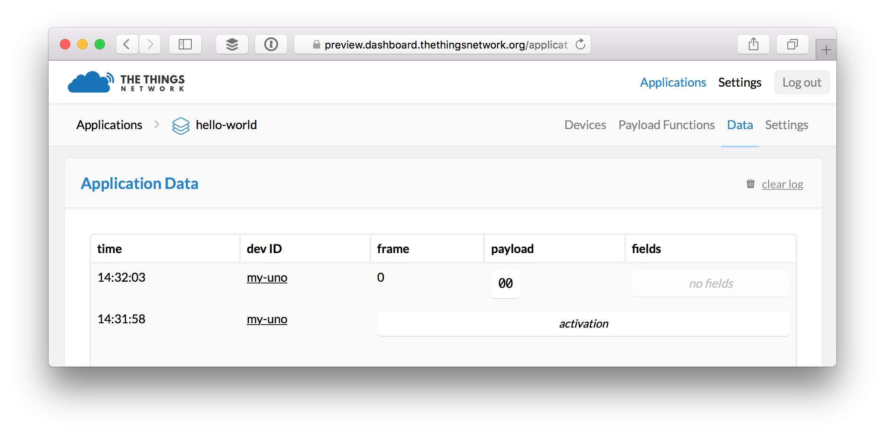
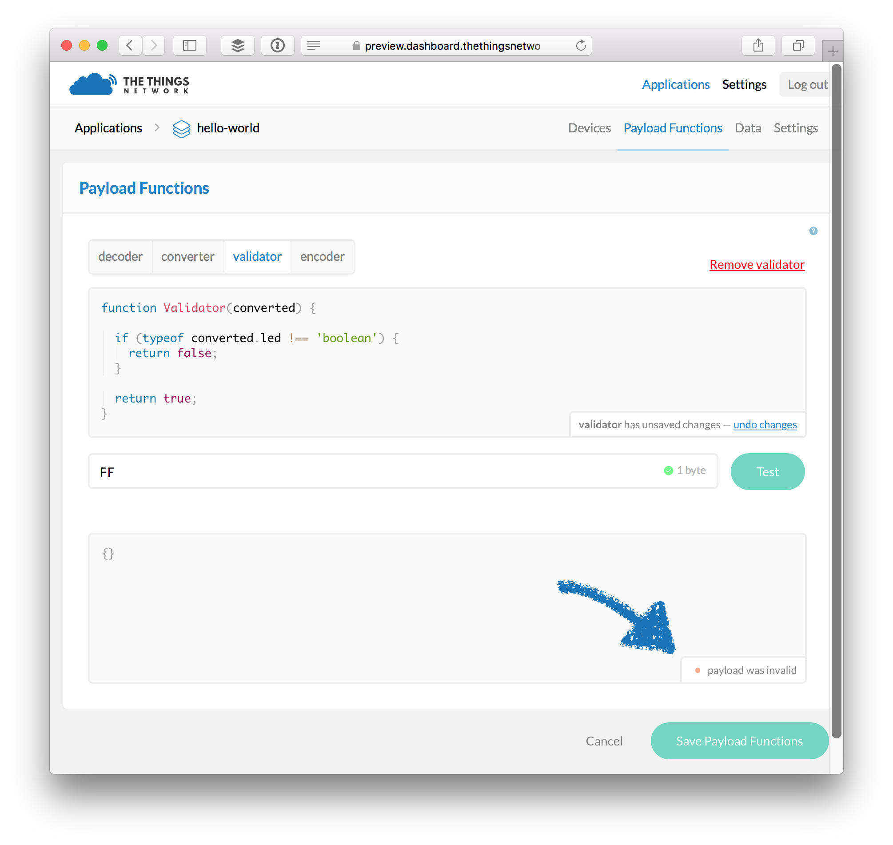
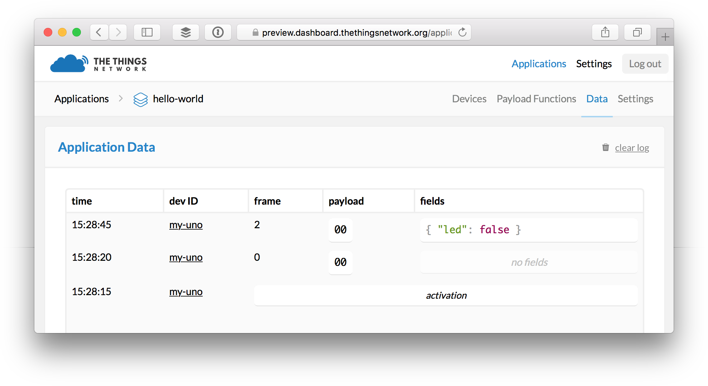
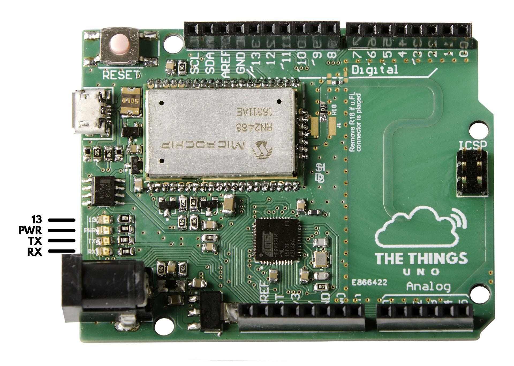
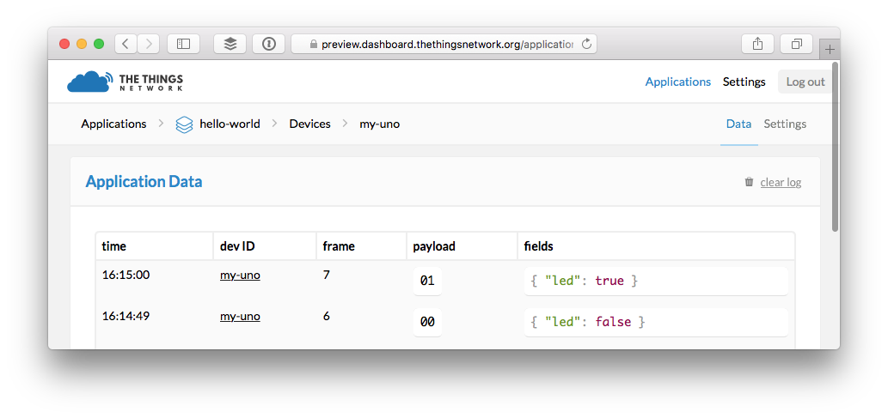

This guide will walk you through programming The Things Uno to send and receive your first message via The Things Network. We'll use the [Hello, World!](https://en.wikipedia.org/wiki/%22Hello,_World!%22_program) of Arduino: [`LED_BUILTIN`](https://www.arduino.cc/en/Reference/Constants). 💡

The full sketch of this Quick Start is also included in TheThingsNetwork library for the Arduino IDE. You can find it under **File > Examples > TheThingsNetwork > [QuickStart](https://github.com/TheThingsNetwork/arduino-device-lib/blob/master/examples/QuickStart/QuickStart.ino)**.

## Setup Arduino IDE
Let's start by setting up the software we'll need to program your device.

1. [Download](https://www.arduino.cc/en/Main/Software) and install the latest Arduino Software (IDE).
2. Navigate to **Sketch > Include Library > Manage Libraries...**.
3. Search for **TheThingsNetwork** and click the result to select it.
4. Click the **Install** button which should appear:

  

The Arduino IDE will notify you of updates for the IDE and library automagically. :open_mouth:

> See the [Arduino Guide](../../arduino/index.md) for more details.

## Connect your Device
Next, connect your device to the IDE over USB.

1.  Use the included Micro-USB cable to connect The Things Uno to an USB port of your computer.
2.  In Arduino IDE select **Tools > Board > Arduino Leonardo**.
3.  Navigate to **Tools > Port** and select the port that identifies as **Arduino Leonardo**.

    

If you don't see a port that identifies as **Arduino Leonardo** make sure The Things Uno's power LED is on and check the cable and USB port you have used. On Windows, you might need to [install drivers](https://www.arduino.cc/en/Guide/ArduinoLeonardoMicro#toc2). See [Arduino Troubleshooting](https://www.arduino.cc/en/Guide/Troubleshooting#toc16) for more suggestions.

## Create a Sketch
Let's program your device with a so-called sketch.

1.  In the Arduino IDE, select **File > New** `Ctrl/⌘ N`.

    This should get you the basic structure with [`setup()`](https://www.arduino.cc/en/Reference/Setup) and [`loop()`](https://www.arduino.cc/en/Reference/Loop):
    
    ```c
    void setup() {
      // put your setup code here, to run once:
    	
    }
    	
    void loop() {
      // put your main code here, to run repeatedly:
    	
    }
    ```

2.  Select **Sketch > Include Library > TheThingsNetwork**.

    This should prepend an [`#include`](https://www.arduino.cc/en/Reference/Include) for TheThingsNetwork library:
    
    ```c
    #include <TheThingsNetwork.h>
    ```

3.  Let's leave `loop()` for what it is and replace all code above it with the following:

    ```c
    #include <TheThingsNetwork.h>
    
    #define loraSerial Serial1
    #define debugSerial Serial

    // Replace REPLACE_ME with TTN_FP_EU868 or TTN_FP_US915
    #define freqPlan REPLACE_ME
    
    TheThingsNetwork ttn(loraSerial, debugSerial, freqPlan);
    
    void setup() {
      loraSerial.begin(57600);
      debugSerial.begin(9600);
      
      // Initialize LED output pin
      pinMode(LED_BUILTIN, OUTPUT);
    
      // Wait a maximum of 10s for Serial Monitor
      while (!debugSerial && millis() < 10000);
    
      debugSerial.println("-- STATUS");
      ttn.showStatus();
    }
    ```
    
    > Replace `REPLACE_ME` with `TTN_FP_EU868`, `TTN_FP_US915`, `TTN_FP_AU915` or `TTN_FP_IN865_867`, depending on the frequency plan of your device and your country. (Click [here](https://www.thethingsnetwork.org/docs/lorawan/frequencies-by-country.html) for an overview of all frequency plans per country).

    This will do a few things:
    
    1.  Use [`#define`](https://www.arduino.cc/en/Reference/Define) to create more meaningful aliases for the [`Serial`](https://www.arduino.cc/en/Reference/Serial) ports for the LoRa modem and the USB connection, as well as the frequency plan.
    2.  Create an instance `ttn` of TheThingsNetwork class, passing the serial ports and the frequency plan.
    3.  Call [`begin()`](https://www.arduino.cc/en/Serial/Begin) to set the data rate for both serial ports.
    4.  Wait for the Arduino IDE's Serial Monitor to open communication via USB, but no longer than 10 seconds (10.000ms).

        > This trick works because [`if(Serial)` will return `true`](https://www.arduino.cc/en/Serial/IfSerial) when communication is open and [`millis()`](https://www.arduino.cc/en/Reference/Millis) will give us the time since `setup()` was called.
        
    6.  Use [`println()`](https://www.arduino.cc/en/Serial/Println) to log to the Serial Monitor and call `ttn.showStatus()` to do the same, which will give us the information we need for our next step.

## Get your Device EUI
To communicate via The Things Network, you need to register your device. For this, we'll need its unique **Device EUI**. This is a unique address, hard coded into the LoRa module. The `ttn.showStatus()` method we added in the previous step will get us this and other information about our device.

1.  In the Arduino IDE, select **Sketch > Upload** `Ctrl/⌘ U` to upload the sketch.

    > Uploads might fail if the Serial Monitor is open or if the IDE lost track of [the port you selected](../#connect-your-device). Close the monitor, check the port selection and try again. If it still fails, check [Arduino Troubleshooting](https://www.arduino.cc/en/Guide/Troubleshooting#toc1).

2.  Within 10 seconds, select **Tools > Serial Monitor** `Ctrl/⌘ Shift M` to open the [Serial Monitor](https://www.arduino.cc/en/Guide/Environment#toc12).

    Soon, it should print a list of information:

    ```
    -- STATUS
    EUI: 0004A30B001B7AD2
    Battery: 3223
    AppEUI: 70B3D57EF000001C
    DevEUI: 0004A30B001B7AD2
    Band: 868
    Data Rate: 5
    RX Delay 1: 1000
    RX Delay 2: 2000
    Total airtime: 0.00 s
    ```
    
    Use the first `EUI` value to register your device.

> Next time you need the Device EUI of a device, simply select **File > Examples > TheThingsNetwork > [DeviceInfo](https://github.com/TheThingsNetwork/arduino-device-lib/blob/master/examples/DeviceInfo/DeviceInfo.ino)**, only set the frequency plan and upload this sketch which will call `ttn.showStatus()` every 10 seconds.

🎉 You have connected your device, written your first sketch, uploaded it to your device and monitored your device logs to retrieve its Device EUI.

## Create an Account
To register your device you'll need a The Things Network account.

1.  Go to [account.thethingsnetwork.org](https://account.thethingsnetwork.org) and click [create an account](https://account.thethingsnetwork.org/register).

    You will receive an email to confirm your email address. You have 24 hours to do so, so let's now wait for that and carry on! 🚀

    > You can change all but your username later via your [Profile](https://account.thethingsnetwork.org/users/profile).

2.  Select [Console](https://console.thethingsnetwork.org) from the top menu.
3.  From the top right menu, select your name and then [Settings](https://console.thethingsnetwork.org/settings) from the dropdown menu to change the default Handler if the one currently selected is not where you'll be deploying most of your devices.

## Add an Application
Devices need to be registered with an application to communicate with. Let's add one.

1.  On [console.thethingsnetwork.org](https://console.thethingsnetwork.org/), click [add application](https://console.thethingsnetwork.org/applications/add).

	* For **Application ID**, choose a unique ID of lower case, alphanumeric characters and nonconsecutive `-` and `_`.
	* For **Description**, enter anything you like.
	* Leave the checkbox enabled to automatically register the application to your default region.

	

2.  Click **Add application** to finish.

    You will be redirected to the newly added application.

## Register your Device
You are now ready to register your device to the application.

1.  On the application's screen, scroll down to **Devices** or select **Devices** from the top right menu.
2.  In the **Devices** box, click **register device**.

    * For **Device ID**, choose a - for this application - unique ID of lower case, alphanumeric characters and nonconsecutive `-` and `_`.
    * For **Device EUI**, copy-paste the **DevEUI** [you retrieved from your device](../#get-your-device-eui).
    * Leave the **App Key** to be randomly generated.
    * Leave the default **App EUI** selected.

    

4.  Click **Register** to finish.

    You will be redirected to the newly registered device, where you can find the generated **App Key** which we'll need next.

## Activate your Device
Now that we have registered the device, we can activate the connection from our device itself.

> Activation means that the device will use the generated App Key to negotiate session keys for further communication. This is also known as Over The Air Activation or OTAA. There's also [Activation By Personalization](../../registration.md#personalize-device-for-abp) (ABP) where you set or generate the session keys via the console and hard-code them on your device.

1.  In the console, scroll down the device's screen to **Example Code** and copy the keys:

    

2.  Paste the keys right after the `#include` of your sketch.
3.  In the `setup()` function, copy the following code just after `ttn.showStatus()`:
    
    ```c
    debugSerial.println("-- JOIN");
    ttn.join(appEui, appKey);
    ```

4.  Select **Sketch > Upload** `Ctrl/⌘ U` to upload the sketch and then **Tools > Serial Monitor** `Ctrl/⌘ Shift M` to open the Serial Monitor.

    You should see something like:
    
    ```
    -- STATUS
    EUI: 0004A30B001B7AD2
    Battery: 3223
    AppEUI: 70B3D57EF000001C
    DevEUI: 0004A30B001B7AD2
    DevAddr: 260127C6
    Data Rate: 5
    RX Delay 1: 1000
    RX Delay 2: 2000
    Total airtime: 0.00 s
    -- JOIN
    Version is RN2483 1.0.1 Dec 15 2015 09:38:09, model is RN2483
    ...
    Sending: mac set appeui with 8 bytes
    Sending: mac set deveui 0004A30B001B7AD2
    Sending: mac set appkey with 16 bytes
    Sending: mac join otaa
    Join accepted. Status: 00000401
    DevAddr: 26012E93
    ```

🎉 Your device is now activated and connected to The Things Network!

## Message the application
Let's say hello! Most Arduino boards have an on-board LED and the constant [`LED_BUILTIN`](https://www.arduino.cc/en/Reference/Constants) (scroll all the way down) will tell us which pin it is connected to. We are going send a message to tell us if it's on or not. Exciting! 💡

1.  In the Arduino IDE, go back to your sketch and replace the `loop()` function with:

    ```c
    void loop() {
      debugSerial.println("-- LOOP");
    
      // Prepare array of 1 byte to indicate LED status
      byte data[1];
      data[0] = (digitalRead(LED_BUILTIN) == HIGH) ? 1 : 0;
    
      // Send it off
      ttn.sendBytes(data, sizeof(data));
      
      delay(10000);
    }
    ```

    This will do a few things:
    
    1.  Create an [array](https://www.arduino.cc/en/Reference/Array) of [bytes](https://www.arduino.cc/en/Reference/byte) to hold our message.

        > With LoRaWAN, airtime is expensive. The bigger the message, the more airtime it will cost. Encode any message you need to send in as little bytes as you can. See [Working with Bytes](../../bytes.md) to learn more.
        
    2.  Use [`digitalRead`](https://www.arduino.cc/en/Reference/DigitalRead) to get the current value of the LED pin. This will be either [constants](https://www.arduino.cc/en/Reference/Constants) `HIGH` or `LOW`, which we translate to `1` and `0`.

    3.  Call `ttn.sendBytes()` to send the message. This takes the array itself as well as its length via [`sizeof()`](https://www.arduino.cc/en/Reference/Sizeof).
    
        > Can't `sendBytes()` figure out the length you're asking? The short answer: no. For a longer answer, check [Stack Overflow](http://stackoverflow.com/a/8464659).
        
    4. Pause 10 seconds between loops.
        
4.  Select **Sketch > Upload** `Ctrl/⌘ U` to upload the sketch and then **Tools > Serial Monitor** `Ctrl/⌘ Shift M` to open the Serial Monitor.

    You should see something like:
    
    ```
    -- LOOP
    Sending: mac tx uncnf 1 with 1 bytes
    Successful transmission
    ```

## Monitor & Decode Messages
Let's see the messages come in.

1.  From the application's screen in the console, select **Data** from the top right menu.

    You should now see the messages come in:

    

    What you see is the raw payload in hex-formatted, space-separated bytes. Let's decode that to meaningful fields.

2.  Select **Payload Functions** from the top right menu.
3.  Leave **decoder** selected and copy-paste [the following JavaScript code](https://github.com/TheThingsNetwork/arduino-device-lib/blob/master/examples/QuickStart/Decoder.js):

    ```js
    function Decoder(bytes, port) {
      // Decode an uplink message from a buffer
      // (array) of bytes to an object of fields.
      var decoded = {};
        
      if (port === 1) decoded.led = bytes[0];
        
      return decoded;
    }
    ```
    
4.  Use the input field and **Test** button to see how various payloads of hex-formatted, space-separated bytes are decoded by selecting the first byte (as number) for a field called `led`:

    * `00` becomes `{ "led": 0 }`
    * `01` becomes `{ "led": 1 }`
    * `FF` becomes `{ "led": 255 }`
    * `01 02 03` becomes `{ "led": 1 }`

5.  Now select **converter** and copy-paste [the following code](https://github.com/TheThingsNetwork/arduino-device-lib/blob/master/examples/QuickStart/Converter.js):

    ```js
    function Converter(decoded, port) {
      // Merge, split or otherwise
      // mutate decoded fields.
      var converted = decoded;
        
      if (port === 1 && (converted.led === 0 || converted.led === 1)) {
        converted.led = Boolean(converted.led);
      }
        
      return converted;
    }
    ```
    
6.  Again, test with various bytes to how the decoded object gets converted to more meaningful values:

    * `00` becomes `{ "led": false }`
    * `01` becomes `{ "led": true }`
    * `FF` becomes `{ }`
    * `01 02 03` becomes `{ "led": true }`

7.  Next, select **validator** and paste [this code](https://github.com/TheThingsNetwork/arduino-device-lib/blob/master/examples/QuickStart/Validator.js):

    ```js
    function Validator(converted, port) {
      // Return false if the decoded, converted
      // message is invalid and should be dropped.
        
      if (port === 1 && typeof converted.led !== 'boolean') {
        return false;
      }
        
      return true;
    }
    ```
    
8.  Run another round of tests to verify all payloads that don't convert to have a boolean `led` property are marked invalid:

    
    
    Invalid messages will be dropped and not published to services that have subscribed to this application's messages.
    
9.  Click **Save Payload Functions** to save all three in one go.

10. Select **Data** from the top right menu.

11. If your device is still sending data any (valid) new messages should now show their decoded and converted payload in the **fields** column:

    
    
🎉 You can now decode cryptic byte messages to meaningful payloads!    

> Would you like to learn how to receive and further process these messages? Head over to the [MQTT](../../../applications/mqtt/index.md) guide!

## Message your device
Now let's send a message to your device in return.

> There are different [classes of LoRa devices](https://www.lora-alliance.org/What-Is-LoRa/Technology). Like most devices, The Things Uno and Node can only receive the single last message queued for them in response to a message they send themselves.

We'll prepare your device to receive a message in response.

1.  In the Arduino IDE, add the following line to `setup()` function to let it know what function to call when a message comes in:

    ```c
    // Set callback for incoming messages
    ttn.onMessage(message);
    ```

2.  Then copy paste the actual function to the end of the sketch:

    ```c
    void message(const byte* payload, int length, int port) {
      debugSerial.println("-- MESSAGE");
    
      // Only handle messages of a single byte
      if (length != 1) {
        return;
      }
    
      if (payload[0] == 0) {
        debugSerial.println("LED: off");
        digitalWrite(LED_BUILTIN, LOW);
          
      } else if (payload[0] == 1) {
        debugSerial.println("LED: on");
        digitalWrite(LED_BUILTIN, HIGH);
      }
    }
    ```
    
    The function will use [`digitalWrite()`](https://www.arduino.cc/en/Reference/DigitalWrite) to turn the LED on or off, based on the single byte message we receive.

3.  Select **Sketch > Upload** `Ctrl/⌘ U` to upload the sketch and then **Tools > Serial Monitor** `Ctrl/⌘ Shift M` to open the serial monitor.
4.  In the console, navigate to your application, **Devices** and select your device.
5.  With the serial monitor still open, enter `01` in the input field of the **Downlink** box and click **Send**.

    The next time your device sends a message it should display something like:
    
    ```
    -- LOOP
    Sending: mac tx uncnf 1 with 1 bytes
    Successful transmission. Received 1 bytes
    LED: on
    ```
    
    And... there was light! 💡
    
    
    
    > Note: The LED is labelled `13` next to the power supply, in the image above. 

5.  From the device screen, select **Data** from the top right menu and you should see that the next message the device sends indeed confirms the LED is now on:

    
    
6.  As a bonus, try sending `00` to turn of the LED and verify that the next message confirms it.

🎉 Congrats! You just closed the circle and can communicate via The Things Network in both ways.

## Encode Messages
What would be cooler than turning a LED on by sending `00`? Sending `{ "led": true }` of course! Just like we decode message on arrival on The Things Network we can also encode messages to devices before they will be delivered.

1.  In the console, navigate to the application and select **Payload Functions** from the top right menu.
2.  Select **encoder** and use [the following code](https://github.com/TheThingsNetwork/arduino-device-lib/blob/master/examples/QuickStart/Encoder.js):

    ```js
    function Encoder(object, port) {
      // Encode downlink messages sent as
      // object to an array or buffer of bytes.
      var bytes = [];
        
      if (port === 1) bytes[0] = object.led ? 1 : 0;
        
      return bytes;
    }
    ```

4.  Use the input field and **Test** button to see how various [JSON encoded](http://www.json.org) payloads will be encoded as displayed in hex-formatted, space-separated bytes:

    * `{ "led": false }` becomes `00`
    * `{ "led": true }` becomes `01`
    * `{ "foo": "bar" }` becomes ` ` (nothing)

    > There is no separate converter and validator function for this direction. Return an empty array to drop the message.
    
5.  Click **Save Payload Functions**.
6.  Select **Devices** from the top right menu and select your device.
7.  With the serial monitor still open, select **fields** in the **Downlink** box, enter `{ "led": true }` in the input field and click **Send**.

    You should now see the LED turn on again and be able to verify in the logs and console data monitor. Don't forget to try `true` as well, you never know! 😉

🙌 You have now completed the Quick Start and are able to send messages, decode, convert and validate them and respond with encoded messages. Go build something!

## What's next?

Next, you'll want to:

1.  Learn how to receive and send messages from anywhere using [MQTT](../../../applications/mqtt/index.md) or our [Node-RED](../../../applications/nodered/quick-start.md) or [Node.js](../../../applications/nodejs/quick-start.md) library.
2.  Learn how to add sensors and actuators to your device to harvest data and trigger actions anywhere, thanks to the long range, low power The Things Network.

    Let [The Things Lab](https://www.thethingsnetwork.org/labs/stories?search=&c2=on&c3=on&c4=on&c5=on) inspire you!

    > We'll have a guide on encoding and decoding sensor and actuator data for efficient communication soon.
