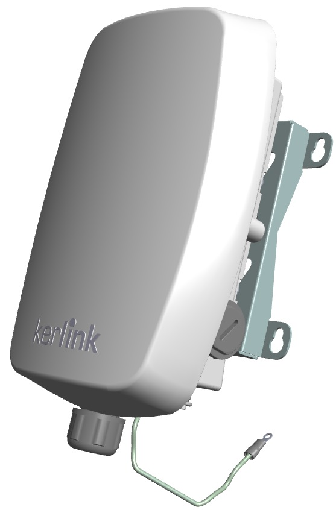

The wirnet iStation is the replacement of the legacy Wirnet Station gateway. It is an outdoor LoRaWAN nano gateway that can be easily connected through Ethernet or cellular, with a built-in LoRa 2.6 dBi antenna..



[Source & further info](https://wikikerlink.fr/wirnet-productline/doku.php?id=wiki:istation:hardware_arch_case_accessories_istation)
*You do need to request a login and password from Kerlink*


## Powering the iStation

Use a POE-enabled switch, or use a POE injector, then connect the RJ45 cable to the iStation.

Alternatively, it is also possible to supply DC power. The input voltage range is 42 to 57VDC and power supply is isolated.

## Connecting to the iStation

iStations are named after their serial number and are called `klk-wiis-XXXXXX`. You can replace the `XXXXXX` by the six hexadecimal digits from the serial number which are also the last six hexadecimal digits of the **Board ID** (printed on the bottom of the gateway).

> For example, if an iStation has `921CHa010001` as board ID, the host name will be: `klk-wiis-010001`

### Ethernet or cellular

Both ethernet and cellular can be used, though for setup Ethernet is preferred.

### iStation login/password

To prevent Web robots from attacking the gateway with standard login/password “root/root”, default password is built using the last 6 characters of the board ID: `pdmk-XXXXXX`. 

For example, if an iStation has `921CHa010001` as board ID, then the root password will be `pdmk-010001` (case sensitive).

```
klk-wiis-010001 login: root
Password: pdmk-010001
```

> For security reasons, it is highly recommended to change the password. You can do so with the command: `passwd`


### Install and configure the gateway

Follow the [unified generic KerOS guide](../keros) to install and configure your gateway.


