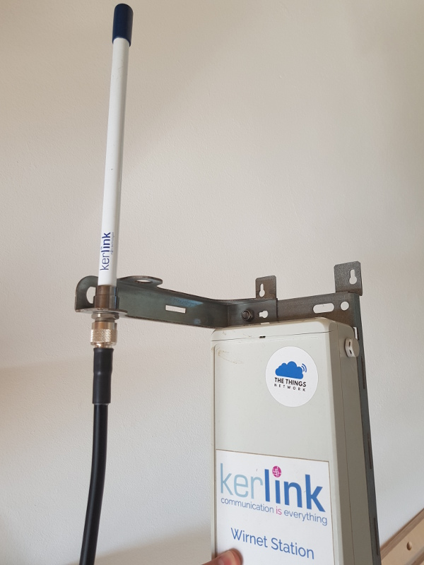
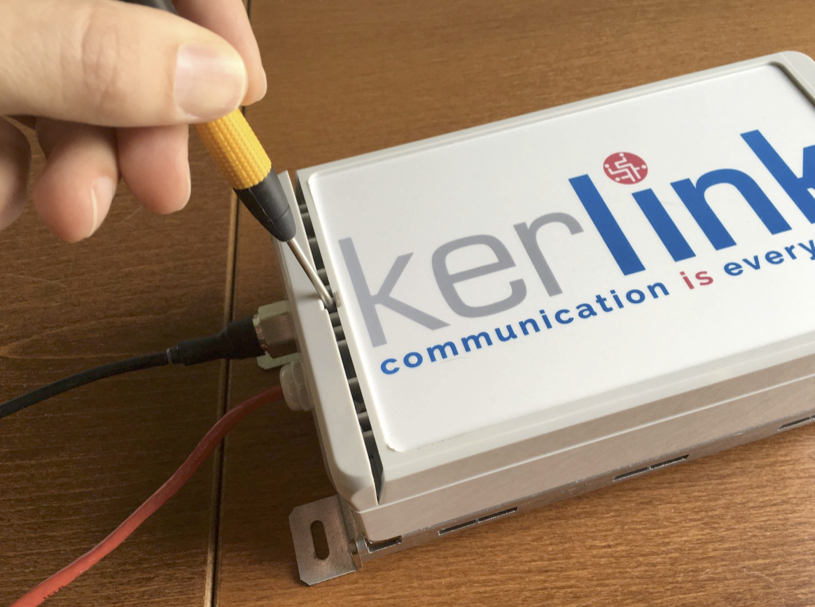
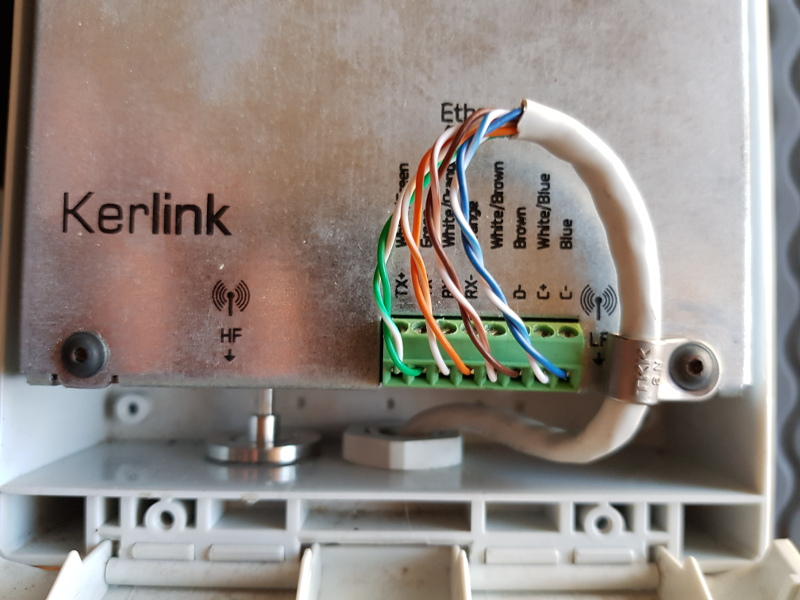
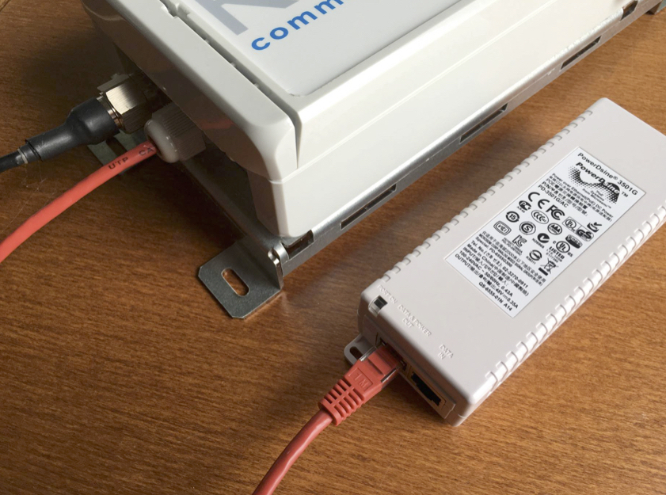
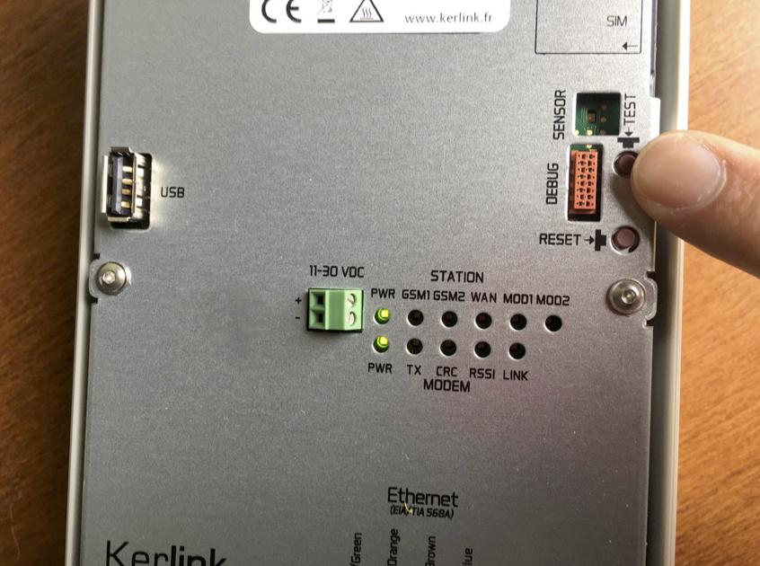

# Setup

## Main functions

### Power

The gateway gets its power by PoE (Power over Ethernet) through the UTP cable or by the 11-30 volt connector on the gateway. The 11-30 volt power connector makes it possible to combine the gateway with a DC solar system. There is also a backup battery inside the gateway which can provide up to 1 min of power to ensure a safe shutdown of the gateway.

The gateway supports both the 802.3af and 802.3at PoE specifications, although there are some incompatible PoE devices: TP-Link TL-POE150S, Cisco Catalyst 3850, TP-LINK TL-SF1008P, NETGEAR FS108PEU, Laird POE-48I. The bundled PoE adapter is usually 15W, for outdoor use 30W is recommended. The [default Microsemi one](https://www.microsemi.com/product-directory/single-port-non-rackmount-midspans/3931-pd-3501g-ac), Microsemi PD9001GR/AT/AC and Tenda PoE15F injectors seem to work correctly.

### Data

The gateway can be connected to the internet using ethernet or by a cellular GSM/3G network.

### Antenna

The antenna comes with a 1m of RG58 coax cable with N-type male connectors on each end. The antenna is a 3dBi gain omnidirectional. There is also a bracket to mount the antenna in the correct orientation to the gateway body.

It is advised to always have the antenna connected when switching on the gateway. Booting the gateway without an external antenna my result in damage to the low noise amplifier. Depending on the environment where the gateway is placed, earthing and [surge protection](../lightning-protection.md) is recommended.

## UTP cable

After unpacking the Kerlink Wirnet Station, open the case by putting a screwdriver in the bottom notch (where the antenna connector is located).

Connect a UTP network cable to the green screw terminal. Cable colors are noted next to the connector. You can use an existing cable by cutting off the connector from one side, or you need to make up a new cable with an RJ45 connector on one end, [watching the color scheme](https://en.wikipedia.org/wiki/TIA/EIA-568).

Attach the UTP cable attached to the Kerlink Wirnet Station to the “data & power Out” port of the power adapter. Connect the “data IN” port of the power adapter to your existing network. If you use PoE switches, the power adapter is not needed.

After powering on, check your DHCP server which IP-address the gateway uses. In the rare case that your network doesn't use a DHCP server, the gateway will use the static IP `192.168.4.155`. The LEDs inside the gateway do not work by default, they only work for about a minute after shortly pressing the “Test” button. This includes the power LEDs.

To check if the gateway is online you can try to ping its IP address, or try and log into it using SSH.

## USB port

The USB 1.1 Type-A port is used for flashing gateway firmware.

## Debug port

The debug port can be used to attach to the Linux console of the gateway. See [Configuration](config.md) for more information.

## SIM-card

If you'd like to use a GPRS/3G connection, insert the SIM-card now. The gateway uses a "standard SIM" / "regular SIM" / "Mini-SIM" / 2FF sized sim card.

1. Remove the SIM card holder of the Kerlink Wirnet Station by pressing the extraction button with a little screwdriver.
2. Place the SIM card in the SIM card holder.
3. Carefully insert the SIM card holder with the SIM card in the Kerlink Wirnet Station.
4. Configure the settings for the SIM card.

