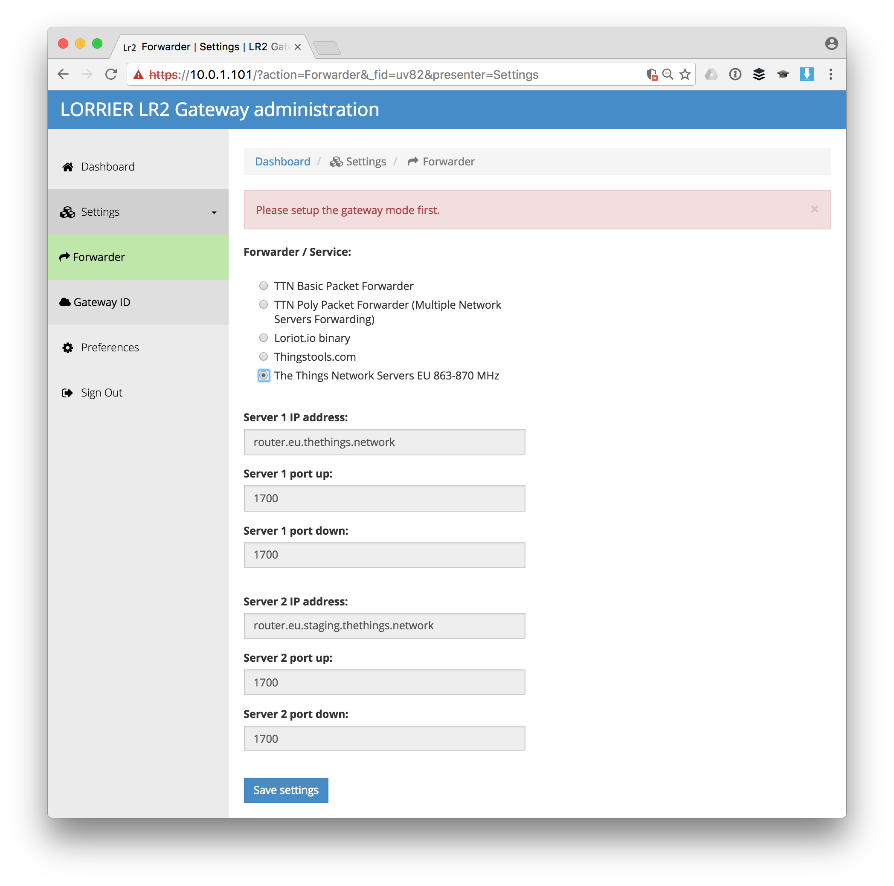
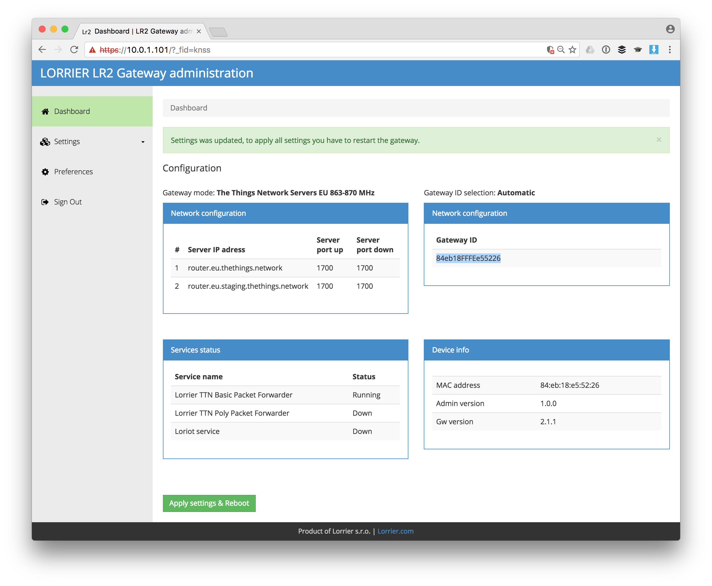

Here's how you setup the Lorrier LR2 for The Things Network.

## General Setup

This guide follows most of the [LR2 Quick Settings Guide](https://github.com/lorriercom/lorrier-lr2/blob/master/LR2_Quick_Settings.md). For more details and troubleshooting see the documentation in the [Lorrier LR2 Repository](https://github.com/lorriercom/lorrier-lr2).

1.  Connect the antenna to your LR2.

    > Connecting the LR2 to power (over ethernet) without antenna or appropriate attenuator connected will damage the device.
    
2.  Connect your LR2 to the ethernet and power using the enclosed POE (Power Over Ethernet) adapter. Booting takes about 60 seconds.

    > The casing does not have external LEds. There have been cases where the LED on the POE adapter was on while the LR2 itself wasn't. If the next steps fail, open the casing to verify the LEDs on the boards are also on. If they are not, connect the power directly to the board and order anew POE adapter.
    
3.  The LR2 by default is configured with `192.168.1.2` as static IP address. If this doesn't match the IP range of the network you will connect it to, you will need to change this first.

    * Follow [Change Static IP Address](../ip.md) if needed.
        
4.  If you're not connected via Winbox tools already to change the IP address then [do so now](../winbox.md) to change your password.

    * Go to **System > Password**.
    * The default password is `lorrier`.

6.  Change your BeagleBone Green (BBG) passwords.

    1.  Connect to the LR2 via [SSH](https://help.ubnt.com/hc/en-us/articles/218850057-Back-to-Basics-How-to-Establish-a-Connection-Using-SSH).

        * As address use the LR2's (new) static IP plus `:2222` for the port.
        * The default username is `root` and password `lorrier`.
    
    2.  To change the passwords type `passwd root` and `passwd debian`.

## Configuration

1.  Open the LR2 web interface in your browser.

    * As address use the LR2's (new) static IP.
    * You might need to authorize the safety certificate.

2.  Login with the defaults username `admin` and password `lorrier.

3.  You will be asked to select your **Forwarder / Service**. If you come back later, select **Forwarder** from the left menu. Then select **The Things Network Servers EU 863-870 Mhz** and click **Save settings**:

    

4.  On the next screen let the LR2 generate a Gateway ID or set one manual and click **Save settings**:
    
    
    
5.  When you get back to the dashboard, take note of the generated Gateway ID:
    
    

6.  In the left menu, select **Preferences** to change the default password:

    

7.  Go back to the **Dashboard** and click **Apply settings & Reboot**

8.  [Register your gateway](https://www.thethingsnetwork.org/g/new/edit) using the Gateway ID.

👏 Your gateway is now connected to The Things Network!
