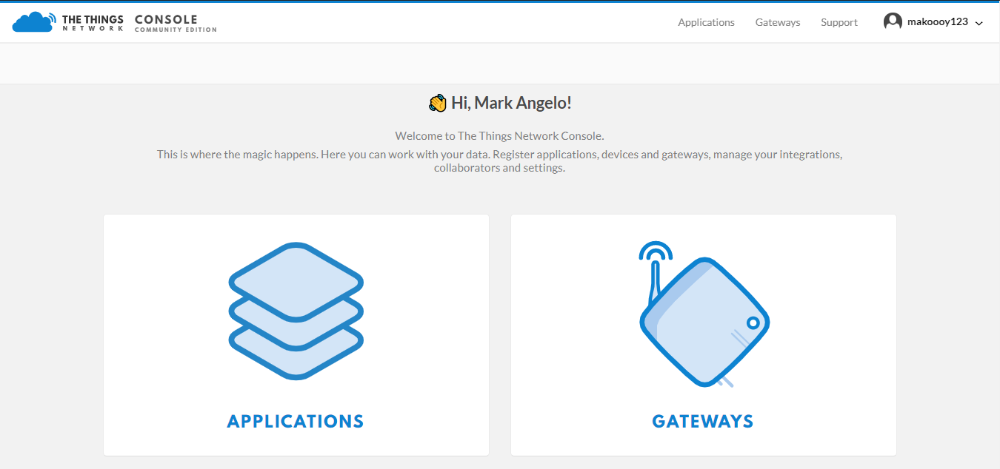
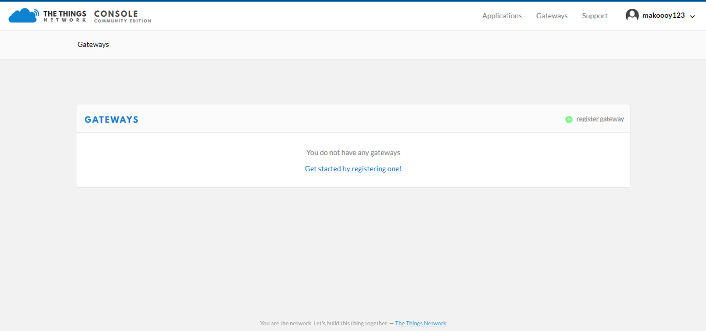

The Things Network is about enabling low power devices to use long range gateways to connect to an open-source, decentralized network to exchange data with Application. Learn more about the Things Network here.

* First, you should have connected your LoRa Gateway to the router in order to access the internet according to the method which has been introduced in the “Configure your LoRa Gateway” section of this document.
* Second, config your LoRa Gateway and choose TTN as the LoRa Server and choose a correct frequency according to the method which has been introduced in the Configuring the Gateway section.
Now go to the TTN Website: https://www.thethingsnetwork.org/ and Login. You will then see the following page:

* Choose Console then Click Gateway.

* All of your Registered Gateways will be displayed here in this page. Click **"register gateway"**

* **Gateway EUI** - this is your Gateway ID that you obtained in the previous step. If you forgot, just type `gateway-version` in the command line. This must be the same with the LoRa Gateway's True Gateway ID otherwise you will fail to register your LoRa Gateway on TTN.
* Make sure to select the "I'm using the legacy packet forwarder" check box.
* **Description** - A human readable description of your LoRa Gateway.
* **Frequency Plan** - This is the frequency you want to use and it must be the same with LoRa Gateway and the LoRa Node.
* **Router** - The router this gateway will connect to. To reduce latency, pick a router that is in a region which is close to the location of the gateway.
* **Location** - Choose the location of the Gateway by entering its coordinates. This is reflected on the Gateway World Map!
* **Antenna Placement** - Where is your antenna placed? Is it placed indoors or outdoors?

Click **Register Gateway** and wait for a couple of minutes . If the status of your gateway is Connected, Congratulations! Your LoRa Gateway is now connected to the The Things Network (TTN).

You have also the option to connect your LoRa Gateway with **LoRaServer.** Go to this [guide](https://doc.rakwireless.com/rak2245-pi-hat/connect-the-lora-gateway-with-loraserver) to learn how!