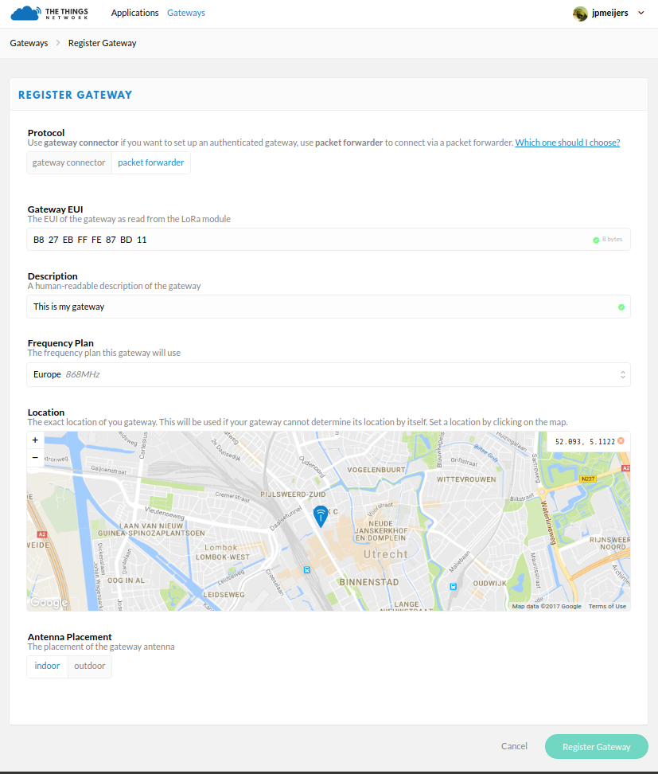

# Gateway Registration

The main packet forwarders used in the LoRaWAN market, is Semtech's UDP Packet Forwarder (also referred to as the Legacy Forwarder). 

* Packet forwarders that connect using the Semtech UDP protocol (such as the [Semtech UDP Packet Forwarder](packet-forwarder/semtech-udp.md)). This protocol is not encrypted, but its simplicity makes it work on a large number of gateways.

Please read this guide carefully to understand how to register your gateway with The Things Network.

> If you have an off-the-shelf gateway with the default software, it most likely uses the Semtech UDP protocol. Follow the steps for connecting using the [UDP Packet Forwarder](#via-udp-packet-forwarder).

## Via Semtech UDP Packet Forwarder

### Start with Configuration

Follow your gateway's manual to configure it to forward packets to The Things Network. Configure it to forward to the correct [router address for your region](packet-forwarder/semtech-udp.md). The guide should also help you set or retrieve the gateway's EUI, likely the MAC address of the LoRa module which looks like `B827EBFFFE87BD11`.

You will likely also need the `global_conf.json` file for the frequency plan used in your region. You can find it on [our github repo](https://github.com/TheThingsNetwork/gateway-conf).

> If your gateway does not have a GPS module we advise you not to configure a manual location in the gateway. Do this in the Console instead so that you can change it without accessing the gateway.

### Packet Forwarder Bridge

We have a special bridge in place that will continue to accept packages from gateways using the UDP Packet Forwarder. It will lowercase the EUI and prefix it with `eui-`. So a gateway with EUI `B827EBFFFE87BD11` will appear in meta data and APIs as `eui-b827ebfffe87bd11`.

### Register

[Register your gateway](https://console.thethingsnetwork.org/gateways/register) via the console. This will link it to your account so that you can manage it.

* For **Protocol**, select **packet forwarder**.
* For **Gateway EUI**, paste your gateway's EUI (8 bytes).
* Select the frequency plan ([determined by your region](../lorawan/frequencies-by-country.md)) the gateway uses.
* Click to drop the pin at the exact location (pan and zoom in before you drop).

> After registering the gateway, select **Settings** from the top right menu on the Gateway screen so set the gateway description, location altitude, privacy settings and other information.

### Unregistered Gateways

If you don't register your gateway, The Things Network will still accept packets it forwards, but mark them as **untrusted**. The gateway will appear on the [map](https://www.thethingsnetwork.org/map) as **Unregistered**. You will not be able to manage its configuration (e.g. location) from the Console.

## Troubleshooting & FAQ

### Could not register gateway

If you return to the Gateways screen without seeing the newly registered gateway you will probably also see the following error on the top right:

This means someone else already registered this Gateway ID or EUI. If you registered to use the UDP Packet Forwarder, check the manual of your gateway to see if you can configure it with a [different (random) EUI](https://www.randomlists.com/string?length=16).
