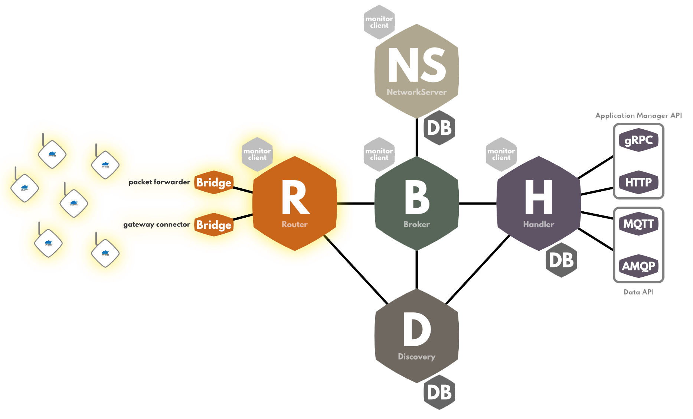

This page explains **how packet forwarders exchange data with TTN**. You don't need to understand all of this to make a gateway work, but if you're curious of how packet forwarders work, this can help you!

## The Things Network Router

Packet forwarders connect to The Things Network through the **router** component. This component is tasked with [handling gateway data and status](https://github.com/TheThingsNetwork/ttn/tree/develop/core/router), and to transfer data to the rest of the network.



+ For **uplinks**: the router receives uplinks from gateways, parses the uplink content for MAC payload and activations, computes new downlink windows, finds a broker to transmit the packet to, and transmits the uplink.

+ For **status messages**: the router uses them to keep track of active gateways.

+ For **downlinks**: the router receives a downlink from upstream, waits for a gateway to be available near the device, builds downlink options from the gateway options, and transmits it.

## Protocols

Messages can be transmitted from a gateway to TTN through two protocols: the legacy Semtech UDP protocol, and our new Gateway Connector protocol.

### Semtech UDP protocol

The Semtech UDP protocol is, historically, the first gateway protocol that was developed for LoRaWAN. It was built by Semtech, who [still maintain](https://github.com/Lora-net/packet_forwarder) it.

With this protocol, uplinks, statuses and downlinks are exchanged in a pseudo-JSON format, through UDP, between the gateway and the network server. Because of the simplicity of the messages and of the protocol, it is easy to reproduce this protocol, for testing purposes or for bootstrapping.

Because this protocol was implemented in the first packet forwarder publicly available, most gateways include a basic packet forwarder running this protocol.

#### Example

```json
{
  "rxpk": {
    "tmst":20900514000,
    "chan":2,
    "rfch":0,
    "freq":866.349812,
    "stat":1,
    "modu":"LORA",
    "datr":"SF7BW125",
    "codr":"4/6",
    "rssi":-35,
    "lsnr":5,
    "size":23,
    "data":"AMy7qgAAAAAATYMmmnj6AADl6YP1Jrw"
  }
}
```

*Excerpt of a Semtech UDP message, with an uplink message - for example, `data` holds the payload, `tmst` the gateway time of reception, `rssi` the RSSI value...*

#### Drawbacks of the UDP protocol

However, this protocol lacks features for production-ready networks:

+ It does not provide **authentication**. Gateways are supposed to identify themselves with their EUI - but anyone can usurpate another gateway.

+ There is no **encryption** available. Gateway messages can be intercepted - and modified - during transport.

+ Message exchange is not **reliable**, since the exchange is over 2-way UDP.

+ The UDP protocol is based on a format close to JSON, but not fully compliant ; for example, the specs specify that an object can hold multiple properties with the same index. This makes it easy to write by hand for testing purposes, but difficult to parse in some situations.

### Gateway connector protocol

Because of the reasons above, we've developed a new protocol, solving these issues: the **gateway connector protocol**. With this protocol:

+ Gateways are identified by an **ID** and by a **key**. Sending a message to a router requires to know the combination.

+ Messages are sent encoded in **[protocol buffers](https://developers.google.com/protocol-buffers/)**. This serialisation technology allows transfer of data from a program to another, in native types, **regardless of the language**.

With the gateway connector protocol, messages can be exchanged through two network protocols:

+ If your hardware and software supports it, through [gRPC](https://grpc.io), which supports protocol buffers natively. gRPC supports TLS encryption natively.

+ Otherwise, protocol buffer-encoded messages can be sent through MQTT. MQTTS, a variant of MQTT, enforces TLS encryption.

#### Using the gateway connector protocol

Using the gateway connector protocol to send messages happens in two steps:

+ First, you need to obtain the **type files**, in your programming language, generated from the protocol buffer files. Both the protocol buffer files and pre-generated files for some languages can be found [here](https://github.com/TheThingsNetwork/api) - if your language isn't in the repository, you can look up how to generate code for your language [in the official protocol buffer documentation](https://developers.google.com/protocol-buffers/docs/reference/overview). With these type files, you can start building messages in these types.

+ The second step is sending them over to The Things Network. You'll need to identify yourself (using the gateway ID and gateway key) to the account server to obtain a token, then send messages to the router with this token.

#### Example using gRPC

In this example built in the Go language, we'll show two functions:

+ The first one, `createUplinkMessage`, **builds an uplink message** in the protocol-buffer generated types ;
+ The second function, `connectAndSendUplink`, **sends an uplink** to The Things Network over **gRPC**.

```go
import (
  "github.com/TheThingsNetwork/go-account-lib/account"
  "github.com/TheThingsNetwork/api/discovery"
  "github.com/TheThingsNetwork/api/gateway"
  "github.com/TheThingsNetwork/api/protocol"
  "github.com/TheThingsNetwork/api/protocol/lorawan"
  "github.com/TheThingsNetwork/api/router"
)

const (
  gatewayID = "INSERT_GATEWAY_ID"
  gatewayKey = "INSERT_GATEWAY_KEY"

  accountServer = "https://account.thethingsnetwork.org"
  discoveryServer = "discovery.thethings.network:1900"
  routerID = "ttn-router-eu"
)

func createUplinkMessage(payload []byte) *router.UplinkMessage {
  // Creating a dummy uplink message, using the protocol buffer-generated types
  return &router.UplinkMessage{
    GatewayMetadata: &gateway.RxMetadata{
      Rssi: -35,
      Snr:  5,
    },
    Payload: payload,
    ProtocolMetadata: &protocol.RxMetadata{
      Protocol: &protocol.RxMetadata_Lorawan{
        Lorawan: &lorawan.Metadata{
          CodingRate: "4/5",
          DataRate:   "SF7BW125",
          Modulation: lorawan.Modulation_LORA,
        },
      },
    },
  }
}

func connectAndSendUplink(uplink *router.UplinkMessage) error {
  // Connecting to the TTN account server to fetch a token
  gwAccount := account.NewWithKey(accountServer, gatewayKey)
  gw, err := gwAccount.FindGateway(gatewayID)
  if err != nil {
    return err
  }
  token := gw.Token.AccessToken

  // Connecting to the TTN discovery server to get a connection to the router
  discoveryClient, err := discovery.NewClient(discoveryServer, &discovery.Announcement{Id: gatewayID}, func() string { return "" })
  if err != nil {
    return err
  }

  // Connecting to the router
  routerAccess, err := discoveryClient.Get("router", routerID)
  if err != nil {
    return err
  }

  routerConn := routerAccess.Dial()
  routerClient := router.NewRouterClientForGateway(router.NewRouterClient(c.routerConn), gatewayID, token)
  uplinkStream := router.NewMonitoredUplinkStream(routerClient)

  // Sending the uplink
  if err := uplinkStream.Send(uplink); err != nil {
    return err
  }
  // Uplink sent successfully!
  return nil
}
```
