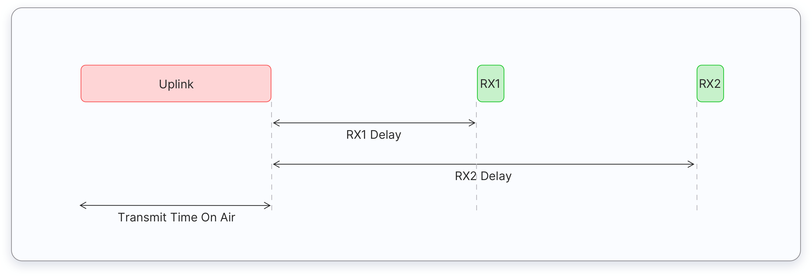
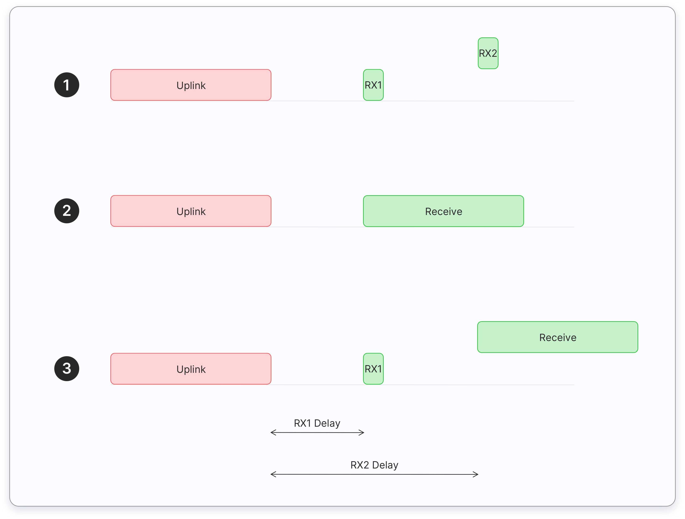
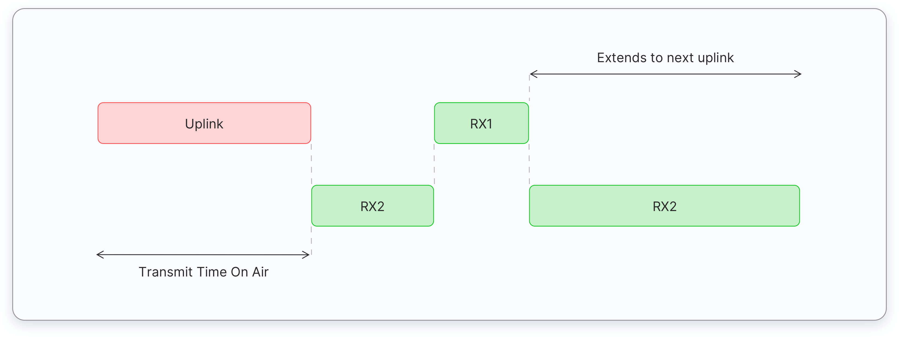

The LoRaWAN specification defines three device types: **Class A**, **Class B**, and **Class C**. All LoRaWAN devices **must** implement Class A, whereas Class B and Class C are extensions to the specification of Class A devices.

## Class A

**Class A** devices support bi-directional communication between a device and a gateway. Uplink messages (from the device to the server) can be sent at any time. The device then opens two receive windows at specified times (RX1 Delay and RX2 Delay) after an uplink transmission. If the server does not respond in either of these receive windows, the next opportunity will be after the next uplink transmission from the device.

_Figure: Class A Receive Window Diagram_

The server can respond either in the first receive window, or in the second receive window, but should not use both windows. If the device receives an uplink in the first receive window, it will not open the second receive window. Below, Case 1 shows the end device opening both receive windows. In Case 2, it receives a downlink in the first window and does not opoen the second. In Case 3, it receives a downlink in the second receive window.

_Figure: Class A Receive Window Diagram with Downlinks_

_1: Device Receives No Uplink and Opens Both Receive Windows_

Class A end devices:

*   Are often battery-powered
*   Have the lowest energy consumption
*   Spend most of the time in sleep mode
*   Usually keep long intervals between uplinks
*   Have high downlink latency (to receive a downlink, the end device must send an uplink)

Some common use cases for Class A end-devices:

*   Environmental monitoring
*   Animal tracking
*   Fire detection
*   Water leakage detection
*   Earthquake early detection
*   Location tracking

## Class B

**Class B** devices extend Class A by adding scheduled receive windows for downlink messages from the server. Using time-synchronized beacons transmitted by the gateway, the devices periodically open receive windows. The time between beacons is known as the beacon period, and the time during which the device is available to receive downlinks is a "ping slot." Class B devices also open receive windows after sending an uplink, as you can see below:

_Figure: Class B Receive Window Diagram_

Class B end devices have lower latency than the Class A end devices, because they are reachable at preconfigured times and do not need to send an uplink to receive a downlink. The battery life is shorter in Class B than Class A, because the device spends more time in active mode, during beacons and ping slots. 

Some common use cases for Class B end-devices:

*   Smart metering
*   Temperature reporting

## Class C

**Class C** devices extend Class A by keeping the receive windows open unless they are transmitting, as shown in the figure below. This allows for low-latency communication but is many times more energy consuming than Class A devices.

Class C end devices:

*   Are often mains powered
*   Have no downlink latency - continuous receive window

The following are some common **Class C** end device **applications**, but there are more:

*   Utility meters
*   Streetlights

##  Questions

1. Which end device class consumes the lowest power?
   - Class A
   - Class B
   - Class C
   
   
2. Which end device class consumes the highest power?
   - Class A
   - Class B
   - Class C
   
   
3. Which end device class usually runs on mains power?
   - Class A
   - Class B
   - Class C
   
   
4. What does RX1 Delay mean?
   - The delay between the end of the uplink transmission and the start of the RX1 receive window.
   - The delay between the end of the uplink transmission and the start of the RX2 receive window.
   - The delay between the end of the RX1 and the end of the RX2 receive windows.
   - The delay between the start of the RX1 and the start of the RX2 receive windows.
   
   
5. Which device class has the lowest downlink latency?
   - Class A
   - Class B
   - Class C
   
   
6. Which device class has the highest downlink latency?
   - Class A
   - Class B
   - Class C
   
   
7. Which device class is synchronized to the network using periodic beacons?
   - Class A
   - Class B
   - Class C
   
   
8. Which device class only can receive a downlink message after sending an uplink message?
   - Class A
   - Class B
   - Class C
