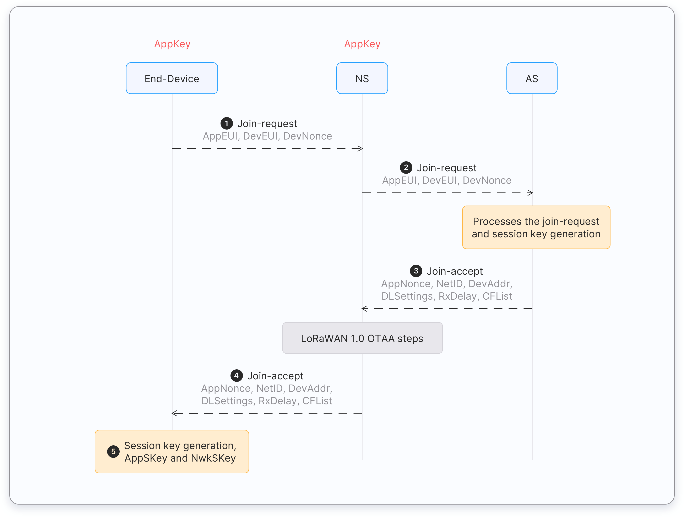
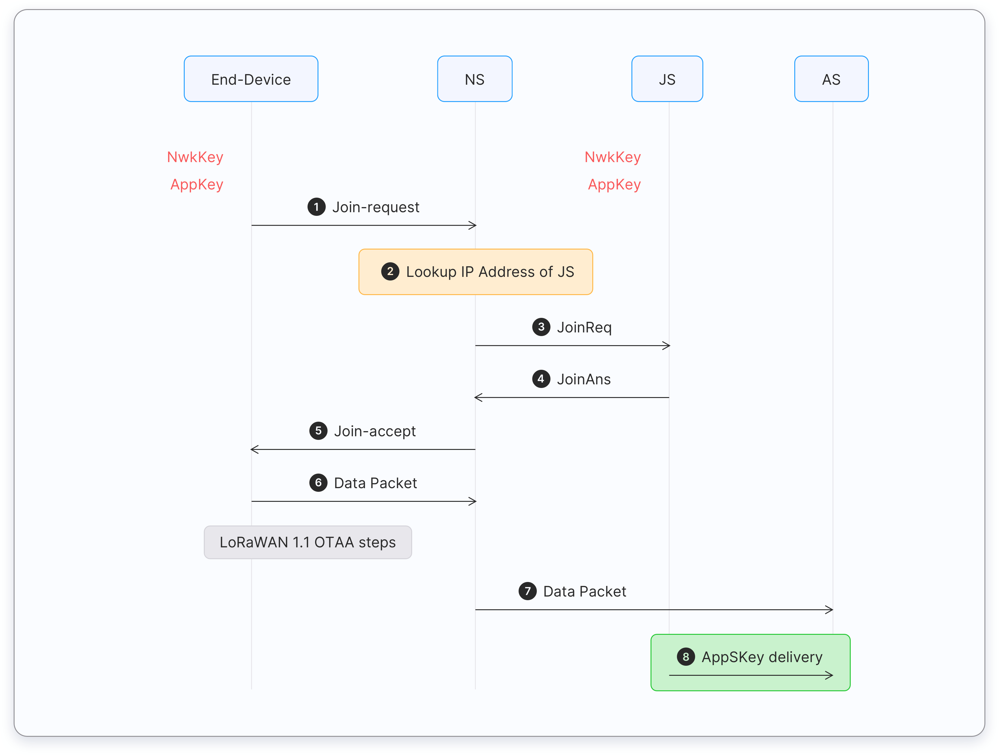
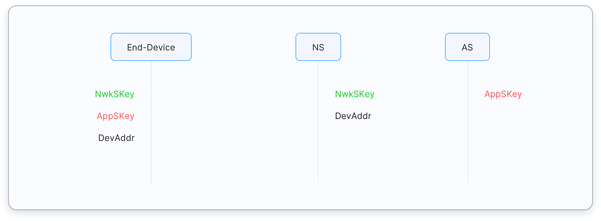
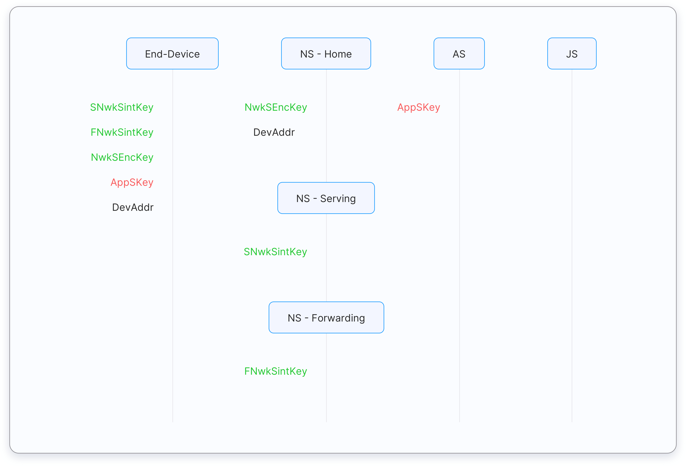

Every end device must be registered with a network before sending and receiving messages. This procedure is known as **activation**. There are two activation methods available:

* **Over-The-Air-Activation (OTAA)** - the most secure activation method for end devices. Devices perform a join procedure with the network, during which a dynamic device address is assigned and security keys are negotiated with the device.
* **Activation By Personalization (ABP)** - requires hardcoding the device address as well as the security keys in the device. ABP is **less secure** than OTAA and also has the downside that devices can not switch network providers without manually changing keys in the device. 

The join procedure for LoRaWAN 1.0.x and 1.1 is slightly different. The following two sections describe the join procedure for LoRaWAN 1.0.x and 1.1 separately.

## Over The Air Activation in LoRaWAN 1.0.x

In LoRaWAN 1.0.x, the join procedure involves two MAC messages exchanged between the end device and the network server:

*   Join-request
*   Join-accept

### Before Activation

Before activation, the **AppEUI**, **DevEUI**, and **AppKey** should be stored in the end device. The **AppKey** is an AES-128 bit secret key known as the **root key**. The same **AppKey** should be provisioned onto the network where the end device is going to register. The **AppEUI** and **DevEUI** are not secret and are visible to everyone.



The **AppKey** is **never sent** over the network.



#### OTAA Message Flow

The steps below describe the message flow of the Over-The-Air-Activation (OTAA).

_Figure: Message flow for Over-The-Air-Activation (OTAA) in LoRaWAN 1.0_

##### Step 1

The **Join-request** message is always sent by the **end device**. The **Join-request** message consists of the following three fields.

* **DevEUI** – 64-bit globally unique end-device identifier in IEEE EUI64 address space.
* **AppEUI** – 64-bit globally unique identifier in IEEE EUI64 address space that uniquely identifies the entity able to process the Join-request frame. This is also known as the application identifier.
* **DevNonce** – this is a unique, random, 2-byte value generated by the end device. The network server uses the DevNonce to keep track of each end-device. The DevNonce value is used to prevent replay attacks. If the end device sends a Join-request with a previously used DevNonce, the network server **rejects** the Join-request and does not allow the end device to register with the network.

The structure of the **Join-request** message is shown below. The **Message Integrity Code (MIC)** is calculated using all the fields of the Join-request message and the **AppKey** to ensure integrity of the message, and then added to the end:

<table>
  <tr>
   <td><strong>8 bytes</strong>
   </td>
   <td><strong>8 bytes</strong>
   </td>
   <td><strong>2 bytes</strong>
   </td>
   <td><strong>4 bytes</strong>
   </td>
  </tr>
  <tr>
   <td>AppEUI
   </td>
   <td>DevEUI
   </td>
   <td>DevNonce
   </td>
   <td>MIC
   </td>
  </tr>
</table>



* The **AppKey** is not sent with the **Join-request** message. It is used to calculate the **MIC** only.
* The **Join-request** message is **not encrypted**.



The **Join-request** message can be transmitted using any data rate and using one of the specified join channels. These join channels are region-specific. For example, in Europe an end device can transmit the join-request message by randomly choosing among 868.10 MHz, 868.30 MHz, or 868.50 MHz. The **Join-request** message travels through one or more gateways that simply relay the message back to the network server.



No response is given to the end-device if the Join-request is not accepted.



##### Step 2

Now the **Join-request** message has been received by the Network Server. If the end device is permitted to join with the network the network server will respond to the end device message with the **Join-accept** message.

The **Join-accept** message consists of the following fields.

* **AppNonce** – this is a random value or some form of unique ID provided by the network server. The AppNonce is used by the end device to derive the two session keys, **AppSKey** and **NwkSKey**.
* **NetID** – consists of the network ID (the 7 least significant bits) and the remaining 17 most significant bits are chosen by the network operator.
* **DevAddr** – this is the 32-bit device address assigned by the network server. Consists of NwkID and NwkAddress. The device address is unique within the current network.
* **DLSettings** – this is a 1-byte sized field consisting of downlink settings which the end device should use.
* **RxDelay** – the delay between TX and RX
* **CFList** – contains the optional list of channel frequencies to be used for the end device

The following figure shows the **Join-accept** message with all the above-generated values. The MIC is calculated using the **AppKey** and added to the frame.

<table>
  <tr>
   <td><strong>3 bytes</strong>
   </td>
   <td><strong>3 bytes</strong>
   </td>
   <td><strong>4 bytes</strong>
   </td>
   <td><strong>1 bytes</strong>
   </td>
   <td><strong>1 bytes</strong>
   </td>
   <td><strong>16 bytes</strong>
   </td>
   <td><strong>4 bytes</strong>
   </td>
  </tr>
  <tr>
   <td>AppNonce
   </td>
   <td>NetID
   </td>
   <td>DevAddr
   </td>
   <td>DLSettings
   </td>
   <td>RXDelay
   </td>
   <td>CFList
   </td>
   <td>MIC
   </td>
  </tr>
</table>

The **Join-accept** message itself is then encrypted with the **AppKey**.

##### Step 3

The Network Server sends the encrypted **Join-accept** message back to the end device. The **Join-accept** message is sent as a normal downlink.

##### Step 4

The Network Server sends the **AppSKey** to the **Application Server**.

##### Step 5

The end device uses the **AppKey** to derive the two session keys: the **Network Session Key (NwkSKey)** and the **Application Session Key (AppSKey)**.

##### After Activation

After activation, the following additional information is stored in the end device.

* **DevAddr** - The DevAddr is allocated by the Network Server of the end-device. It is a 32-bit device address that identifies the end-device within the current network. 
* **NwkSKey** - The NwkSKey is used by the end device and network server to calculate and verify the Message Integrity Code (MIC) of all data messages to ensure data integrity. The NwkSKey is also used to encrypt and decrypt payloads with MAC commands.
* **AppSKey** - The AppSKey is used to secure end-to-end communications between the end device and the application server by encrypting payloads with application-specific data.

## Over-The-Air-Activation in LoRaWAN 1.1

In LoRaWAN 1.1, the join procedure involves two MAC messages exchanged between the end device and the Join Server:

*   Join-request
*   Join-accept

##### Before Activation

Before activation, the **JoinEUI**, **DevEUI**, **AppKey**, and **NwkKey** should be stored in the end device. The **AppKey** and **NwkKey** are AES-128 bit secret keys known as **root keys**. The matching **AppKey**, **NwkKey**, and **DevEUI** should be provisioned onto the Join Server that will assist in the processing of the join procedure and session key derivation. The **JoinEUI** and **DevEUI** are **not secret** and visible to everyone.



The **AppKey** and **NwkKey** are never sent over the network.



**OTAA Message Flow:**

The steps below describe the message flow of the Over-The-Air-Activation (OTAA).

_Figure: Message flow for Over-The-Air-Activation (OTAA) in LoRaWAN 1.1_

##### Step 1

The **Join-request** message is transmitted by the **end device**. It consists of the following three fields:

*   **DevEUI** – 64-bit global end-device ID in IEEE EUI64 address space that uniquely identifies the end-device.
*   **JoinEUI** – 64-bit global application ID in IEEE EUI64 address space that uniquely identifies the **Join Server** that can assist in the processing of the Join procedure and session keys derivation.
*   **DevNonce** – this is a 2-byte counter, starting at 0 when the device is initially powered up and incremented with every **Join-request**. The DevNonce value is used to prevent **replay attacks**.



* Learning about replay attacks is beyond the scope of The Things Fundamentals certification.
* In LoRaWAN 1.1 **AppEUI** is replaced with the **JoinEUI**.
* The procedure for joining a LoRaWAN 1.0 end device with the LoRaWAN 1.1 network is also beyond the scope of The Things Fundamentals certification.
* Rejoin-request messages will be covered in The Things Advanced certification.



The structure of the **Join-request** message is shown in the following figure. The MIC is calculated using the **NwkKey**. The calculated MIC is added to the end of the **Join-request** message. The resulting frame is known as the **PHYPayload**:

<table>
  <tr>
    <td><strong>1 byte</strong>
   </td>
   <td><strong>8 bytes</strong>
   </td>
   <td><strong>8 bytes</strong>
   </td>
   <td><strong>2 bytes</strong>
   </td>
   <td><strong>4 bytes</strong>
   </td>
  </tr>
  <tr>
   <td>MHDR
   </td>
   <td>JoinEUI
   </td>
   <td>DevEUI
   </td>
   <td>DevNonce
   </td>
   <td>MIC
   </td>
  </tr>
</table>



* The **NwkKey** is not sent with the **Join-request** message. It is used to calculate the MIC only.
* The **Join-request** message is not encrypted and sent as plain text.



Finally, the end-device transmits the **Join-request** message. The Join-request message can be transmitted using any data rate and using one of the specified join channels. These join channels are region-specific, for example, in Europe an end device can transmit the join-request message by randomly choosing among 868.10 MHz, 868.30 MHz, or 868.50 MHz. The **Join-request** message travels through one or more gateways that simply relay the message back to the network server.



No response is given to the end-device if the Join-request is not accepted.



##### Step 2

The Network Server uses DNS to look up the IP address of the Join Server based on the **JoinEUI** in the received **Join-request** message.

##### Step 3

If DNS lookup succeeds, the Network Server sends a **JoinReq** message (backend message) to the **Join Server**. This message contains the following:

* PHYPayload of the join-request message
* MAC version
* DevEUI
* DevAddr
* DLSettings
* RxDelay
* CFList

##### Step 4

The Join Server processes the **Join-request** message and sends the **JoinAns** message (this is also a backend message) to the Network Server. If successful the **JoinAns** message contains the following:

* PHYPayload with Join-accept message
* Network session keys 
* Serving Network session integrity key (SNwkSIntKey)
* Forwarding Network session integrity key (FNwkSIntKey)
* Network session encryption key (NwkSEncKey)
* Encrypted AppSKey (network server can't read this)

The Network Server prepares the **Join-accept** message based on the above information.

<table>
  <tr>
   <td><strong>1 byte</strong>
   </td>
   <td><strong>3 bytes</strong>
   </td>
   <td><strong>4 bytes</strong>
   </td>
   <td><strong>1 bytes</strong>
   </td>
   <td><strong>1 bytes</strong>
   </td>
   <td><strong>16 bytes</strong>
   </td>
  </tr>
  <tr>
   <td>JoinNonce
   </td>
   <td>NetID
   </td>
   <td>DevAddr
   </td>
   <td>DLSettings
   </td>
   <td>RXDelay
   </td>
   <td>CFList
   </td>
  </tr>
</table>

The **Join-accept** message is encrypted with the **NwkKey**.

##### Step 5

The Network Server forwards the received PHYPayload with the **Join-accept** message to the end-device if the received **JoinAns** message indicates success. The **Join-accept** message is sent as a normal downlink.

The end-device calculates the MIC, and generates the **network session keys** and **AppSKey**.

The **FNwkSIntKey**, **SNwkSIntKey**, and **NwkSEncKey** are derived from the **NwkKey**.

##### Step 6

When the Network receives an uplink packet from the end-device, the Network Server will send the **DevEUI** and encrypted **AppSKey** along with the application payload to the **Application Server**. 

##### Step 7

When the Application Server receives the encrypted **AppSKey** along with the application payload, it will decrypt the **AppSKey** using a secret key shared between the **Join Server** and the **Application Server**, and use the **AppSKey** to decrypt the received payload. If the encrypted **AppSKey** is not made available by the Network Server, then the Application Server will proceed to **Step 8**.

##### Step 8

In this alternative step, the Application Server requests the **AppSKey** directly from the **Join Server**. The Application Server will request the **AppSKey** identified by the **DevEUI** of the end device from the **Join Server** by sending an **AppSKeyReq** message (backend message). The **AppSKey** is encrypted using a shared secret between the **Join Server** and the **Application Server**. The **Join Server** sends the encrypted **AppSKey**, and **DevEUI** to the Application Server in an **AppSKeyAns** message (backend message). The Application Server decrypts the encrypted **AppSKey**, then uses the **AppSKey** to encrypt and decrypt the application payload.

##### After Activation

After activation, the following additional information is stored in the end device.

* **DevAddr** - The DevAddr is allocated by the Network Server of the end-device. It is a 32-bit device address that identifies the end-device within the current network. 
* **FNwkSIntKey** - This is a network session key that is used by the end device to calculate the MIC or part of the MIC of all uplink data messages to ensure data integrity.
* **SNwkSIntKey** - This is a network session key specific to the end device. It is used by the end device to verify the MIC of all downlink data messages to ensure data integrity and to compute half of the uplink messages MIC.
* **NwkSEncKey** - This is a network session key specific to the end device. It is used to encrypt and decrypt uplink and downlink MAC commands transmitted as payload on port 0 or in the FOpt field.
* **AppSKey** - This is an application-specific session key used by both the application server and the end device to encrypt and decrypt the payload field of application specific data messages.

## Activation By Personalization

Activation By Personalization (ABP) directly ties an end-device to a pre-selected network, bypassing the join procedure. Activation by Personalization is the less secure activation method, and also has the downside that devices can not switch network providers without manually changing keys in the device. A join server is not involved in the ABP process.

An end device activated using the ABP method can only work with a single network and keeps the same security session for its entire lifetime.

### Activation By Personalisation in LoRaWAN 1.0.x

In LoRaWAN 1.0.x, the **DevAddr** and the two session keys **NwkSKey** and **AppSKey** are directly stored into the end-device instead of the DevEUI, AppEUI, and the AppKey. The same **DevAddr** should be stored in the Network Server. Each end device should have a unique set of **NwkSKey** and **AppSkey**. The same **NwkSKey** and **AppSKey** should be stored in the Network Server and the Application Server, respectively (see the figure below). 

_Figure: Pre-sharing DevAddr and session keys for ABP in LoRaWAN 1.0_

### Activation By Personalisation in LoRaWAN 1.1

In LoRaWAN 1.1, the **DevAddr** and the four-session keys **FNwkSIntKey**, **SNwkSIntKey**, **NwkSEncKey**, and **AppSKey** are directly stored into the end device instead of the DevEUI, JoinEUI, AppKey, and NwkKey. The same **FNwkSIntKey**, **SNwkSIntKey**, and **NwkSEncKey** should be stored in the Network Server and the and **AppSKey** should be stored in the Application Server. The same **DevAddr** should be stored in the Network Server. 

_Figure: Pre-sharing DevAddr and session keys for ABP in LoRaWAN 1.1_

## Questions

1. What is not a secure activation method?
    - Over The Air Activation (OTAA)
    - Activation By Personalization (ABP)
    
2. What is the most secure activation method?
    - Over The Air Activation (OTAA)
    - Activation By Personalization (ABP)
    
3. What security keys should be stored in an end-device for ABP in LoRaWAN 1.1?
    - FNwkSIntKey, SNwkSIntKey, NwkSEncKey, AppSKey
    - NwkSKey, AppSKey
    - JSIntKey, JSEncKey
    
4. What security keys should be stored in an end-device for ABP in LoRaWAN 1.0.x?
    - FNwkSIntKey, SNwkSIntKey, NwkSEncKey, AppSKey
    - NwkSKey, AppSKey
    - JSIntKey, JSEncKey
